# Information Processing Structure

## Description
Complete research methodology workflow showing the process of developing FAIR assessment structures for HuBMAP datasets through systematic comparison, evaluation, and classification phases.

## Information Processing Workflow

```mermaid
flowchart TD
    Start([Research Methodology]) --> Phase1[Phase I: FAIR Structures Comparison]
    Phase1 --> Phase2[Phase II: Multi-Version Evaluation]
    Phase2 --> Phase3[Phase III: Multi-Assay Evaluation]
    Phase3 --> Phase4[Phase IV: FAIR Evaluation to HuBMAP]
    Phase4 --> Phase5[Phase V: Metadata FAIR Scoring]
    Phase5 --> End([Final FAIR Structure])
    
    subgraph Phase1["Phase I: FAIR Structures Different Guidelines"]
        direction TB
        P1Focus[Focus: Comparing and creating final file<br/>with end results - compare all and store similarities]
        P1Focus --> P1Branches[Branches - Different Files]
        P1Branches --> P1Framework[Frameworks]
        P1Branches --> P1Guidelines[FAIR Guidelines]
        P1Branches --> P1Workflows[Workflows]
        P1Branches --> P1Toolkits[Toolkits]
        P1Branches --> P1Comparative[Comparative Different Methods/Evaluations]
        P1Branches --> P1Evaluating[Evaluating Tool]
        
        P1Framework --> P1Compare[Comparison Process]
        P1Guidelines --> P1Compare
        P1Workflows --> P1Compare
        P1Toolkits --> P1Compare
        P1Comparative --> P1Compare
        P1Evaluating --> P1Compare
        
        P1Compare --> P1Result[Result File:<br/>All things in common]
    end
    
    subgraph Phase2["Phase II: Creating Multi-Version Evaluation"]
        direction TB
        P2Focus[Focus: What metadata is available<br/>for the same assay type across<br/>all different versions to that assay type]
        P2Focus --> P2Branches[Branches]
        P2Branches --> P2AssayTypes[Assay Types]
        P2Branches --> P2Version1[Version 1]
        P2Branches --> P2Version2[Version 2]
        P2Branches --> P2Version3[Version 3]
        
        P2AssayTypes --> P2Compare[Compare data available<br/>across all versions<br/>for each assay type]
        P2Version1 --> P2Compare
        P2Version2 --> P2Compare
        P2Version3 --> P2Compare
        
        P2Compare --> P2Result[Unique elements<br/>across all datasets]
    end
    
    subgraph Phase3["Phase III: Creating Multi-Assay Evaluation"]
        direction TB
        P3Focus[Focus: Check all general metadata elements<br/>and compare metadata elements<br/>for all assay types]
        P3Focus --> P3Branches[Branches]
        P3Branches --> P3AllDatasets[All Datasets<br/>Database Representation]
        P3Branches --> P3CompareFormats[Compare Formats/Metadata]
        
        P3CompareFormats --> P3ATACRNA[ATAC RNA]
        P3CompareFormats --> P3RNASeq[RNA Seq]
        P3CompareFormats --> P3SingleCell[Single Cell]
        P3CompareFormats --> P3BulkRNA[Bulk RNA]
        P3CompareFormats --> P3Other[etc]
        
        P3AllDatasets --> P3Compare[Compare metadata elements]
        P3ATACRNA --> P3Compare
        P3RNASeq --> P3Compare
        P3SingleCell --> P3Compare
        P3BulkRNA --> P3Compare
        P3Other --> P3Compare
        
        P3Compare --> P3Result[General metadata elements<br/>across all assay types]
    end
    
    subgraph Phase4["Phase IV: FAIR Evaluation to HuBMAP"]
        direction TB
        P4Focus[Focus: How to evaluate each metric]
        P4Focus --> P4Elements[Elements to Evaluate]
        P4Elements --> P4ExistingDOI[Existing DOI]
        P4Elements --> P4WorkingDOI[Working DOI Link]
        P4Elements --> P4PatientID[Patient ID]
        P4Elements --> P4SampleID[Sample ID]
        P4Elements --> P4Organism[Organism]
        P4Elements --> P4Other[etc]
        
        P4ExistingDOI --> P4Compare[Comparing: Yes or No]
        P4WorkingDOI --> P4Compare
        P4PatientID --> P4Compare
        P4SampleID --> P4Compare
        P4Organism --> P4Compare
        P4Other --> P4Compare
        
        P4Compare --> P4Category[Determine FAIR Category]
        P4Category --> P4Result[Store all results in file]
    end
    
    subgraph Phase5["Phase V: Metadata FAIR Scoring"]
        direction TB
        P5Focus[Focus: Classification and Weight]
        P5Focus --> P5Types[Types of Features Metadata]
        P5Types --> P5AlwaysRequired[Always Required]
        P5Types --> P5ConditionalRequired[Required to some assay types<br/>Optional to others]
        P5Types --> P5Optional[Optional]
        
        P5AlwaysRequired --> P5Result[Final Classification<br/>and Weighting]
        P5ConditionalRequired --> P5Result
        P5Optional --> P5Result
    end
    
    P1Result --> Phase2
    P2Result --> Phase3
    P3Result --> Phase4
    P4Result --> Phase5
    P5Result --> End
    
    style Phase1 fill:#e1f5ff
    style Phase2 fill:#fff4e1
    style Phase3 fill:#e1ffe1
    style Phase4 fill:#ffe1f5
    style Phase5 fill:#f0e1ff
    style Start fill:#f0f0f0
    style End fill:#e1ffe1
    style P1Result fill:#e1ffe1
    style P2Result fill:#e1ffe1
    style P3Result fill:#e1ffe1
    style P4Result fill:#e1ffe1
    style P5Result fill:#e1ffe1
```

## Phase Descriptions

### Phase I: FAIR Structures Different Guidelines
**Focus**: Compare all existing FAIR guidelines and create a final file storing all similarities and common elements.

**Process**: 
- Collect and analyze frameworks, FAIR guidelines, workflows, toolkits, comparative methods, and evaluating tools
- Compare all sources to identify commonalities
- Generate result file with all shared elements

### Phase II: Creating Multi-Version Evaluation
**Focus**: Identify what metadata is available for the same assay type across all different versions of that assay type.

**Process**:
- Group datasets by assay type
- Compare metadata availability across versions (Version 1, Version 2, Version 3, etc.)
- Identify unique elements present across all dataset versions

### Phase III: Creating Multi-Assay Evaluation
**Focus**: Check all general metadata elements and compare metadata elements across all different assay types.

**Process**:
- Examine all datasets in database
- Compare formats and metadata across assay types (ATAC RNA, RNA Seq, Single Cell, Bulk RNA, etc.)
- Identify general metadata elements common across all assay types

### Phase IV: FAIR Evaluation to HuBMAP
**Focus**: Determine how to evaluate each metric and assign it to appropriate FAIR categories.

**Process**:
- Evaluate specific elements (Existing DOI, Working DOI Link, Patient ID, Sample ID, Organism, etc.)
- Compare presence/absence (Yes or No evaluation)
- Determine which FAIR category each metric belongs to
- Store all evaluation results in structured file

### Phase V: Metadata FAIR Scoring
**Focus**: Classify and weight metadata features based on their importance and requirement level.

**Process**:
- Categorize metadata features into three types:
  - Always Required: Features needed for all datasets
  - Conditionally Required: Required for some assay types, optional for others
  - Optional: Features that may or may not be present
- Apply classification and weighting to create final FAIR scoring structure
