# Methods and Tools

## Description
Visual representation of the computational methods, programming languages, libraries, and infrastructure tools used in the FAIR assessment system for HuBMAP datasets.

## Methods and Tools Diagram

```mermaid
flowchart TD
    Start([FAIR Assessment System]) --> Programming[Programming Environment]
    Programming --> Python[Python 3]
    Programming --> GitHub[GitHub<br/>Version Control]
    Programming --> Bridges2[Bridges-2<br/>Computing Infrastructure]
    
    Python --> CoreLibraries[Core Python Libraries]
    Python --> DataLibraries[Data Processing Libraries]
    Python --> VisualizationLibraries[Visualization Libraries]
    Python --> WebLibraries[Web Framework Libraries]
    Python --> UtilityLibraries[Utility Libraries]
    
    CoreLibraries --> OS[os<br/>File System Operations]
    CoreLibraries --> JSON[json<br/>Data Serialization]
    CoreLibraries --> Logging[logging<br/>System Logging]
    CoreLibraries --> Typing[typing<br/>Type Hints]
    CoreLibraries --> Random[random<br/>Random Operations]
    
    DataLibraries --> Pandas[pandas<br/>Data Manipulation]
    DataLibraries --> NumPy[numpy<br/>Numerical Computing]
    DataLibraries --> HubmapSDK[hubmap_sdk<br/>HuBMAP API Integration]
    
    VisualizationLibraries --> Matplotlib[matplotlib<br/>Plotting and Visualization]
    VisualizationLibraries --> Seaborn[seaborn<br/>Statistical Visualization]
    
    WebLibraries --> Streamlit[streamlit<br/>Interactive Web Interface]
    WebLibraries --> Requests[requests<br/>HTTP Requests]
    
    UtilityLibraries --> TQDM[tqdm<br/>Progress Indicators]
    
    subgraph "Infrastructure"
        GitHub
        Bridges2
        Python
    end
    
    subgraph "Data Processing"
        Pandas
        NumPy
        HubmapSDK
        JSON
    end
    
    subgraph "Visualization"
        Matplotlib
        Seaborn
        Streamlit
    end
    
    subgraph "System Operations"
        OS
        Logging
        Requests
    end
    
    style Start fill:#e1f5ff
    style Python fill:#fff4e1
    style GitHub fill:#e1ffe1
    style Bridges2 fill:#ffe1f5
    style Streamlit fill:#f0e1ff
    style HubmapSDK fill:#fff4e1
    style Pandas fill:#e1ffe1
    style Matplotlib fill:#ffe1f5
```

## Tools and Libraries

### Infrastructure
- **Python 3**: Primary programming language
- **GitHub**: Version control and code repository
- **Bridges-2**: High-performance computing infrastructure

### Core Python Libraries
- **os**: File system operations and path management
- **json**: Data serialization and JSON file handling
- **logging**: System logging and error tracking
- **typing**: Type hints for code documentation
- **random**: Random number generation for testing

### Data Processing Libraries
- **pandas**: Data manipulation, filtering, and aggregation
- **numpy**: Numerical computing and array operations
- **hubmap_sdk**: HuBMAP API integration for dataset access

### Visualization Libraries
- **matplotlib**: Plotting and heatmap generation
- **seaborn**: Statistical data visualization

### Web Framework Libraries
- **streamlit**: Interactive web interface for FAIR score exploration
- **requests**: HTTP requests for API calls and URL validation

### Utility Libraries
- **tqdm**: Progress indicators for long-running operations
