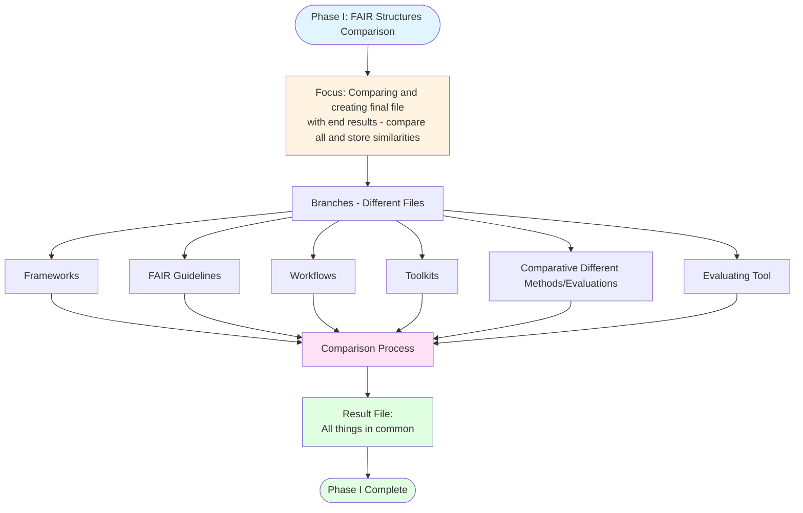

# Phase I: FAIR Structures Different Guidelines

## Description
Comparison phase for evaluating and consolidating all existing FAIR guidelines, frameworks, workflows, and toolkits to create a unified structure.

## Phase I Workflow

## Phase I Components

**Focus**: Compare all existing FAIR guidelines and create a final file storing all similarities and common elements.

**Branches** (Different Files):
- Frameworks
- FAIR Guidelines
- Workflows
- Toolkits
- Comparative Different Methods/Evaluations
- Evaluating Tool

**Output**: Result file containing all common elements identified across all sources.
