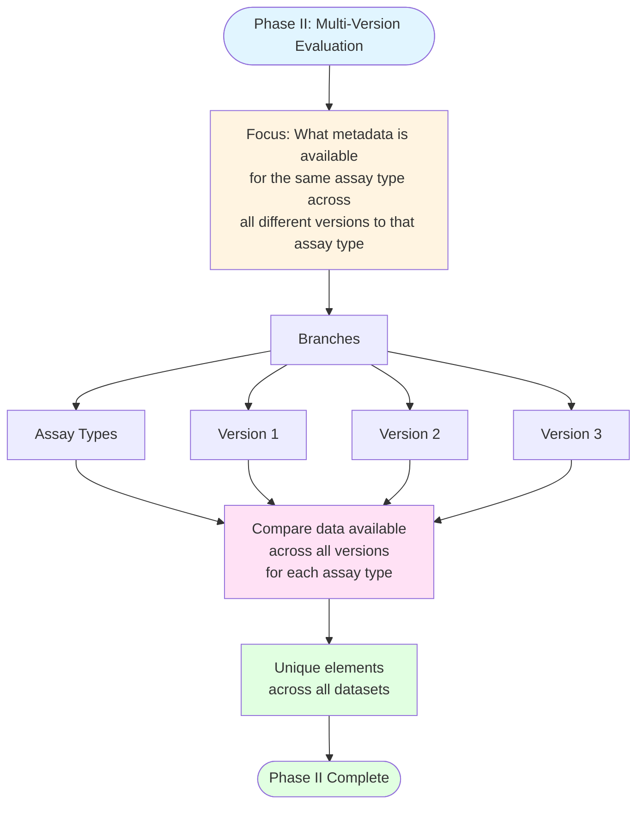

# Phase II: Creating Multi-Version Evaluation

## Description
Evaluation phase for identifying metadata availability across different versions of the same assay type.

## Phase II Workflow

## Phase II Components

**Focus**: Identify what metadata is available for the same assay type across all different versions of that assay type.

**Branches**:
- Assay Types
- Version 1
- Version 2
- Version 3

**Process**: Compare data available across all versions for each assay type.

**Output**: Unique elements across all datasets.
