# Phase IV: FAIR Evaluation to HuBMAP

## Description
Evaluation phase for determining how to assess each metric and assign it to appropriate FAIR categories for HuBMAP datasets.

## Phase IV Workflow

```mermaid
flowchart TD
    Start([Phase IV: FAIR Evaluation to HuBMAP]) --> P4Focus[Focus: How to evaluate each metric]
    
    P4Focus --> P4Elements[Elements to Evaluate]
    
    P4Elements --> P4ExistingDOI[Existing DOI]
    P4Elements --> P4WorkingDOI[Working DOI Link]
    P4Elements --> P4PatientID[Patient ID]
    P4Elements --> P4SampleID[Sample ID]
    P4Elements --> P4Organism[Organism]
    P4Elements --> P4Other[etc]
    
    P4ExistingDOI --> P4Compare[Comparing: Yes or No]
    P4WorkingDOI --> P4Compare
    P4PatientID --> P4Compare
    P4SampleID --> P4Compare
    P4Organism --> P4Compare
    P4Other --> P4Compare
    
    P4Compare --> P4Category[Determine FAIR Category]
    P4Category --> P4Result[Store all results in file]
    P4Result --> End([Phase IV Complete])
    
    style Start fill:#e1f5ff
    style End fill:#e1ffe1
    style P4Focus fill:#fff4e1
    style P4Compare fill:#ffe1f5
    style P4Result fill:#e1ffe1
```

## Phase IV Components

**Focus**: Determine how to evaluate each metric and assign it to appropriate FAIR categories.

**Elements to Evaluate**:
- Existing DOI
- Working DOI Link
- Patient ID
- Sample ID
- Organism
- etc

**Process**: 
- Compare presence/absence (Yes or No evaluation)
- Determine which FAIR category each metric belongs to

**Output**: Store all evaluation results in structured file.
