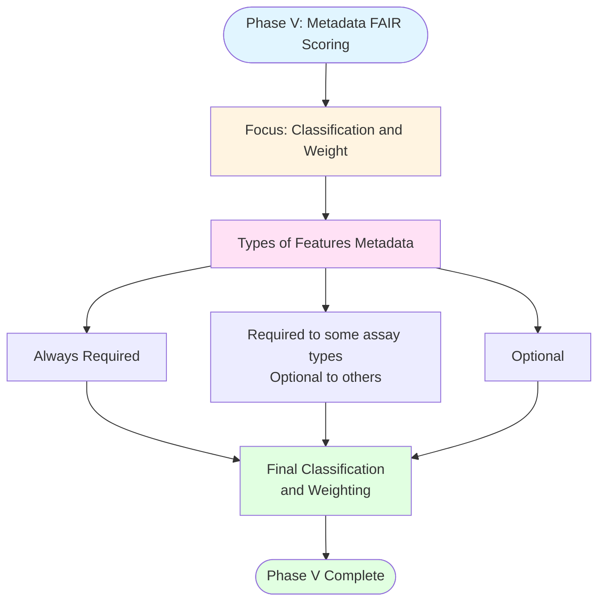

# Phase V: Metadata FAIR Scoring

## Description
Classification and weighting phase for categorizing metadata features based on their importance and requirement level across different assay types.

## Phase V Workflow

## Phase V Components

**Focus**: Classify and weight metadata features based on their importance and requirement level.

**Types of Features Metadata**:
- **Always Required**: Features needed for all datasets regardless of assay type
- **Conditionally Required**: Required for some assay types, optional for others
- **Optional**: Features that may or may not be present

**Output**: Final classification and weighting structure for FAIR scoring.
