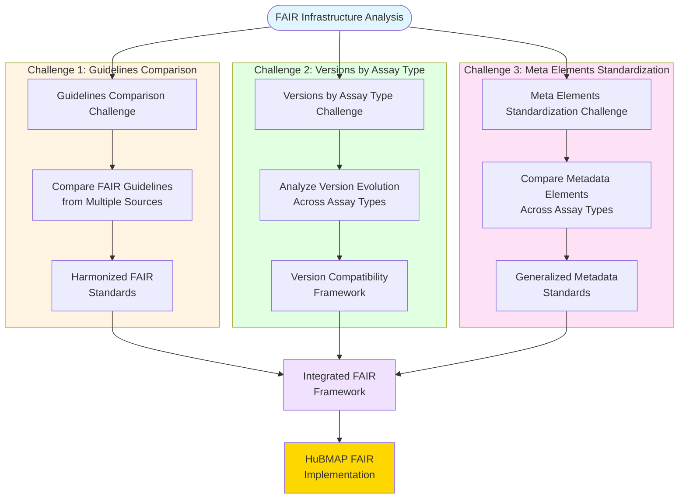

# FAIR Infrastructure Challenges Overview

## Description
High-level overview of the three core challenges in implementing FAIR principles for HuBMAP infrastructure analysis.

## Challenges Overview

## Challenge Breakdown

### Challenge 1: Guidelines Comparison
**Objective**: Harmonize diverse FAIR guidelines from multiple sources into unified standards.

**Key Activities**:
- Collect FAIR guidelines from tools, data repositories, big data projects, and laboratories
- Compare requirements across different domains and contexts
- Resolve conflicts and identify common principles
- Develop harmonized FAIR standards for HuBMAP

### Challenge 2: Versions by Assay Type
**Objective**: Understand how different versions impact various assay types and their FAIR compliance.

**Key Activities**:
- Track version evolution across different HuBMAP assay technologies
- Analyze compatibility between versions and assay types
- Assess FAIR compliance impact of version changes
- Develop version management framework

### Challenge 3: Meta Elements Standardization
**Objective**: Create generalized metadata standards by comparing elements across assay types.

**Key Activities**:
- Compare metadata schemas across different assay technologies
- Identify common metadata elements and requirements
- Develop standardized metadata framework
- Enable cross-assay metadata harmonization

## Integration Strategy

The three challenges converge into an integrated FAIR framework that addresses:
- **Unified Standards**: Harmonized guidelines applicable across contexts
- **Version Awareness**: Framework for managing evolution and compatibility
- **Metadata Consistency**: Standardized elements enabling interoperability

## Expected Outcome

A comprehensive HuBMAP FAIR implementation framework that addresses all three core infrastructure challenges through coordinated analysis and harmonized solutions.