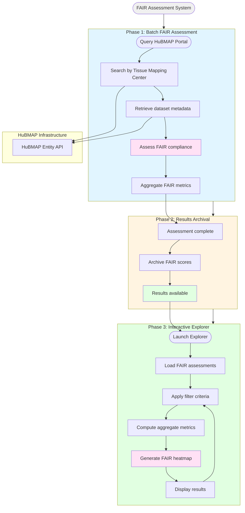

# HuBMAP FAIR Assessment System Architecture

## Description
Complete workflow for evaluating HuBMAP tissue mapping datasets against FAIR principles and providing interactive exploration of compliance metrics.

## System Architecture

## System Phases

### Phase 1: Batch FAIR Assessment
- Query HuBMAP portal for datasets from Tissue Mapping Centers
- Retrieve comprehensive metadata for each dataset
- Evaluate FAIR compliance across four dimensions: Findability, Accessibility, Interoperability, Reproducibility

### Phase 2: Results Archival
- Store FAIR assessment scores in structured format
- Enable fast retrieval for analysis and visualization

### Phase 3: Interactive Explorer
- Load precomputed FAIR assessments
- Filter by TMC, assay type, or dataset identifier
- Generate comparative visualizations of FAIR compliance metrics
