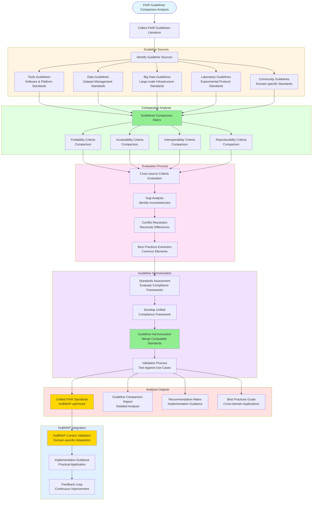

# FAIR Guidelines Comparison Analysis

## Description
Systematic evaluation and comparison of existing FAIR guidelines from diverse sources to establish comprehensive compliance standards for HuBMAP infrastructure analysis.

## FAIR Guidelines Comparison Workflow

## Analysis Framework

### Source Categorization
**Comprehensive Literature Review**: Systematically collect and categorize FAIR guidelines across different domains and implementation contexts.

#### Source Types
- **Tools Guidelines**: Standards from software platforms, computational tools, and workflow systems
- **Data Guidelines**: Requirements from data repositories, databases, and dataset management systems
- **Big Data Guidelines**: Frameworks from large-scale infrastructure projects and cloud platforms
- **Laboratory Guidelines**: Protocols from experimental facilities and research institutions
- **Community Guidelines**: Domain-specific standards from scientific communities and consortia

### Comparative Analysis Process

#### Multi-dimensional Comparison
- **Findability Assessment**: Compare metadata requirements, identifier systems, and discovery mechanisms
- **Accessibility Evaluation**: Analyze access protocols, authentication systems, and availability guarantees
- **Interoperability Analysis**: Examine format standards, API specifications, and integration capabilities
- **Reproducibility Review**: Evaluate provenance tracking, version control, and computational reproducibility

#### Gap Analysis
- **Inconsistency Identification**: Document conflicting requirements between different guideline sources
- **Coverage Assessment**: Identify areas where guidelines are comprehensive vs. sparse
- **Context Sensitivity**: Analyze how guidelines vary based on domain or implementation context

### Harmonization Strategy

#### Conflict Resolution
- **Priority Ranking**: Weight guidelines based on authority, adoption, and relevance to HuBMAP
- **Consensus Building**: Identify common themes and widely-accepted practices
- **Contextual Adaptation**: Customize standards for tissue mapping and multi-omics data

#### Unified Framework Development
- **Core Principles**: Establish fundamental FAIR requirements applicable across all contexts
- **Domain Extensions**: Define specialized requirements for specific data types or workflows
- **Implementation Flexibility**: Provide multiple compliance pathways while maintaining standards

### Expected Outcomes

1. **Unified FAIR Standards**: Comprehensive, harmonized criteria optimized for HuBMAP ecosystem
2. **Comparison Report**: Detailed analysis of existing guidelines with strengths and limitations
3. **Implementation Guidance**: Practical recommendations for applying standards to real datasets
4. **Best Practices Documentation**: Proven strategies extracted from multiple guideline sources
5. **Continuous Improvement Framework**: Mechanism for updating standards based on community feedback

## Integration with HuBMAP Infrastructure

### Validation Process
- **Use Case Testing**: Apply unified standards to representative HuBMAP datasets
- **Stakeholder Review**: Gather feedback from TMCs, data contributors, and end users
- **Iterative Refinement**: Continuously improve standards based on practical implementation experience

### Implementation Support
- **Assessment Tools**: Automated checking mechanisms for compliance evaluation
- **Documentation Resources**: Comprehensive guides for data contributors and consumers
- **Training Materials**: Educational content for community adoption