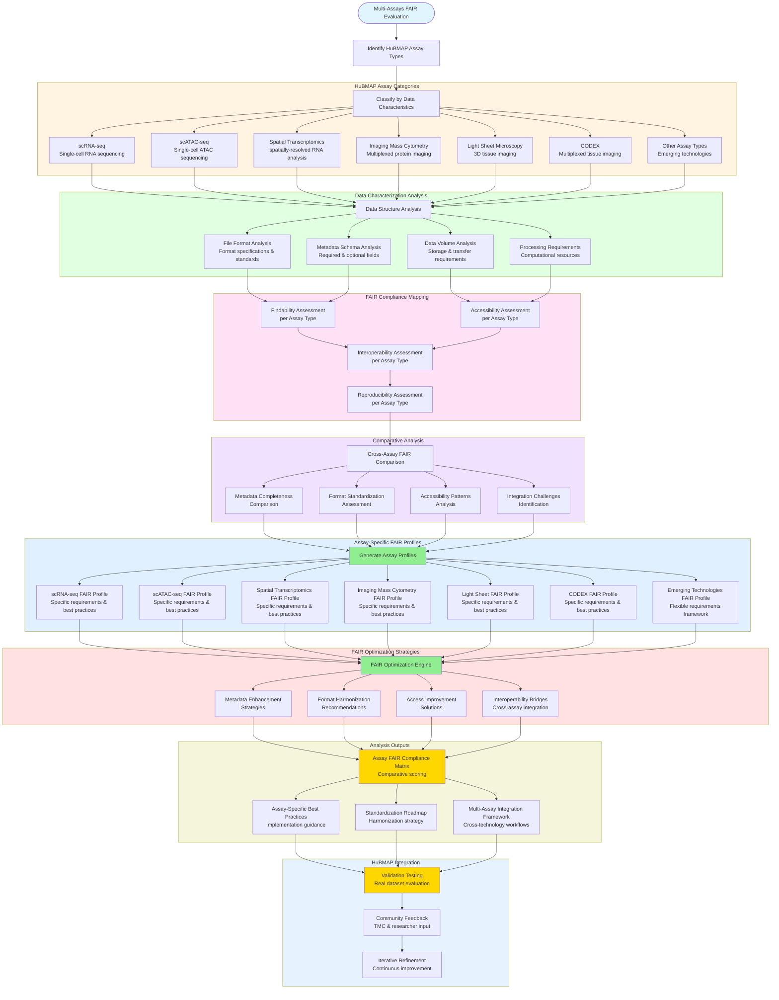

# Multi-Assays FAIR Evaluation

## Description
Comprehensive evaluation of different assay types within HuBMAP ecosystem, analyzing how each aligns with FAIR principles and addressing unique data characteristics and metadata requirements.

## Multi-Assays FAIR Evaluation Workflow

## Analysis Framework

### Assay Type Classification
**Comprehensive Technology Coverage**: Systematic analysis of major HuBMAP assay technologies, considering their unique data characteristics and FAIR compliance requirements.

#### Primary Assay Categories
- **scRNA-seq**: Single-cell transcriptomics with high-dimensional count matrices
- **scATAC-seq**: Single-cell chromatin accessibility with sparse peak matrices
- **Spatial Transcriptomics**: Spatially-resolved gene expression with coordinate systems
- **Imaging Mass Cytometry**: Multiplexed protein imaging with spatial protein distributions
- **Light Sheet Microscopy**: High-resolution 3D tissue imaging with volumetric data
- **CODEX**: Multiplexed tissue imaging with iterative staining cycles
- **Emerging Technologies**: Flexible framework for new and evolving assay types

### Data Characterization Analysis

#### Multi-dimensional Data Assessment
- **File Format Analysis**: Compare standard formats, proprietary formats, and conversion requirements
- **Metadata Schema Evaluation**: Assess completeness, standardization, and domain-specific requirements
- **Data Volume Considerations**: Analyze storage needs, transfer protocols, and computational requirements
- **Processing Pipeline Assessment**: Evaluate computational reproducibility and workflow standardization

#### Technology-Specific Challenges
- **Single-cell Technologies**: High dimensionality, sparsity, batch effects, and quality control metrics
- **Spatial Technologies**: Coordinate systems, image registration, and multi-modal data integration
- **Imaging Technologies**: Large file sizes, proprietary formats, and visualization requirements
- **Multi-omics Integration**: Cross-platform compatibility and harmonization strategies

### FAIR Compliance Mapping

#### Findability Assessment per Assay
- **Metadata Richness**: Technology-specific metadata requirements and completeness
- **Identifier Systems**: Persistent identifiers and cross-reference capabilities
- **Discovery Mechanisms**: Search functionality and filtering capabilities
- **Documentation Standards**: Protocol descriptions and experimental context

#### Accessibility Evaluation per Assay
- **Data Availability**: Public vs. controlled access requirements
- **Format Accessibility**: Standard vs. proprietary format considerations
- **Download Mechanisms**: Bulk vs. selective data retrieval options
- **Technical Requirements**: Software dependencies and computational resources

#### Interoperability Analysis per Assay
- **Format Standardization**: Compliance with community standards
- **API Compatibility**: Programmatic access and integration capabilities
- **Cross-platform Integration**: Multi-assay workflow compatibility
- **Metadata Harmonization**: Consistent terminology and ontology usage

#### Reproducibility Assessment per Assay
- **Processing Provenance**: Workflow documentation and version tracking
- **Parameter Transparency**: Analysis settings and configuration details
- **Computational Environment**: Software versions and dependency management
- **Quality Control**: Standardized metrics and validation procedures

### Comparative Analysis Framework

#### Cross-Assay FAIR Scoring
- **Quantitative Metrics**: Standardized scoring system across technologies
- **Qualitative Assessment**: Technology-specific best practices and challenges
- **Gap Identification**: Areas where specific assays lag in FAIR compliance
- **Improvement Prioritization**: Strategic recommendations for enhancement

#### Integration Challenge Analysis
- **Technical Barriers**: Format incompatibilities and processing differences
- **Metadata Misalignment**: Inconsistent terminology and annotation systems
- **Access Disparities**: Varying availability and usage requirements
- **Workflow Complexity**: Multi-assay analysis pipeline challenges

### Assay-Specific FAIR Profiles

#### Customized Compliance Frameworks
Each assay type receives a tailored FAIR profile including:
- **Minimum Requirements**: Essential criteria for basic FAIR compliance
- **Recommended Practices**: Enhanced standards for optimal FAIR implementation
- **Technology-Specific Guidelines**: Specialized requirements addressing unique characteristics
- **Implementation Roadmap**: Step-by-step guidance for compliance improvement

#### Optimization Strategies
- **Metadata Enhancement**: Technology-specific metadata enrichment recommendations
- **Format Harmonization**: Standardization approaches while preserving technology requirements
- **Access Improvement**: Enhanced discovery and retrieval mechanisms
- **Integration Facilitation**: Cross-assay compatibility and workflow support

## Expected Outcomes

1. **Assay FAIR Compliance Matrix**: Comprehensive scoring and comparison across technologies
2. **Technology-Specific Best Practices**: Detailed implementation guidance for each assay type
3. **Standardization Roadmap**: Strategic plan for harmonizing FAIR implementation
4. **Multi-Assay Integration Framework**: Tools and guidelines for cross-technology workflows
5. **Continuous Assessment Protocol**: Framework for evaluating new and evolving technologies

## HuBMAP Implementation

### Validation and Testing
- **Real Dataset Evaluation**: Apply FAIR assessments to representative HuBMAP datasets
- **Community Validation**: Gather feedback from TMCs and technology experts
- **Iterative Improvement**: Refine assessments based on practical implementation experience

### Community Engagement
- **Training Resources**: Technology-specific FAIR training materials
- **Assessment Tools**: Automated compliance checking for each assay type
- **Best Practices Documentation**: Proven strategies and common pitfall avoidance