# Multi-Version FAIR Evaluation

## Description
Comprehensive analysis tracking evolution of assay implementations across versions, assessing impact on FAIR compliance, data interoperability, and backward compatibility within HuBMAP ecosystem.

## Multi-Version FAIR Evaluation Workflow

```mermaid
flowchart TD
    Start([Multi-Version FAIR Evaluation]) --> VersionIdentification[Identify Version Categories]
    VersionIdentification --> VersionInventory[Create Version Inventory]
    
    subgraph VersionTypes ["Version Categories"]
        direction TB
        VersionInventory --> PipelineVersions[Pipeline Versions<br/>Data processing workflows]
        VersionInventory --> SchemaVersions[Schema Versions<br/>Metadata structure evolution]
        VersionInventory --> ProtocolVersions[Protocol Versions<br/>Experimental procedure updates]
        VersionInventory --> FormatVersions[Format Versions<br/>File structure changes]
        VersionInventory --> StandardVersions[Standard Versions<br/>Community guideline updates]
    end
    
    subgraph VersionTracking ["Version Evolution Tracking"]
        direction TB
        PipelineVersions --> PipelineEvolution[Pipeline Evolution Analysis<br/>Workflow changes over time]
        SchemaVersions --> SchemaEvolution[Schema Evolution Analysis<br/>Metadata field modifications]
        ProtocolVersions --> ProtocolEvolution[Protocol Evolution Analysis<br/>Experimental method updates]
        FormatVersions --> FormatEvolution[Format Evolution Analysis<br/>File structure modifications]
        StandardVersions --> StandardEvolution[Standard Evolution Analysis<br/>Guideline requirement changes]
        
        PipelineEvolution --> ChangeDocumentation[Change Documentation<br/>Version difference analysis]
        SchemaEvolution --> ChangeDocumentation
        ProtocolEvolution --> ChangeDocumentation
        FormatEvolution --> ChangeDocumentation
        StandardEvolution --> ChangeDocumentation
    end
    
    subgraph DataAvailabilityMapping ["Data Availability Mapping"]
        direction TB
        ChangeDocumentation --> AvailabilityMatrix[Version Availability Matrix<br/>Data element presence tracking]
        AvailabilityMatrix --> DataElementTracking[Data Element Tracking<br/>Field presence across versions]
        DataElementTracking --> MetadataEvolution[Metadata Evolution<br/>Schema completeness over time]
        MetadataEvolution --> QualityMetrics[Quality Metrics Evolution<br/>Data richness assessment]
        QualityMetrics --> CoverageAnalysis[Coverage Analysis<br/>Information completeness trends]
    end
    
    subgraph CompatibilityAssessment ["Compatibility Assessment"]
        direction TB
        CoverageAnalysis --> BackwardCompatibility[Backward Compatibility<br/>Legacy data processing]
        BackwardCompatibility --> ForwardCompatibility[Forward Compatibility<br/>New data with old tools]
        ForwardCompatibility --> CrossVersionInterop[Cross-Version Interoperability<br/>Multi-version integration]
        CrossVersionInterop --> MigrationPathways[Migration Pathways<br/>Version transition strategies]
    end
    
    subgraph FAIRImpactAnalysis ["FAIR Impact Analysis"]
        direction TB
        MigrationPathways --> FindabilityImpact[Findability Impact<br/>Version effects on discovery]
        FindabilityImpact --> AccessibilityImpact[Accessibility Impact<br/>Version effects on data access]
        AccessibilityImpact --> InteroperabilityImpact[Interoperability Impact<br/>Version effects on integration]
        InteroperabilityImpact --> ReproducibilityImpact[Reproducibility Impact<br/>Version effects on replication]
    end
    
    subgraph VersionFAIRMatrix ["Version FAIR Matrix Generation"]
        direction TB
        FindabilityImpact --> VersionScoring[Version FAIR Scoring<br/>Quantitative assessment]
        AccessibilityImpact --> VersionScoring
        InteroperabilityImpact --> VersionScoring
        ReproducibilityImpact --> VersionScoring
        
        VersionScoring --> ComplianceEvolution[FAIR Compliance Evolution<br/>Trends over versions]
        ComplianceEvolution --> OptimalVersions[Optimal Version Identification<br/>Best FAIR compliance]
        OptimalVersions --> DeprecationStrategy[Deprecation Strategy<br/>Legacy version handling]
    end
    
    subgraph ManagementFramework ["Version Management Framework"]
        direction TB
        DeprecationStrategy --> VersionGovernance[Version Governance<br/>Lifecycle management]
        VersionGovernance --> UpdateProtocols[Update Protocols<br/>Version transition procedures]
        UpdateProtocols --> CommunicationStrategy[Communication Strategy<br/>Stakeholder notification]
        CommunicationStrategy --> TrainingProgram[Training Program<br/>Version-specific guidance]
    end
    
    subgraph Output ["Analysis Outputs"]
        direction TB
        TrainingProgram --> VersionFAIRReport[Version FAIR Assessment Report<br/>Comprehensive analysis]
        VersionFAIRReport --> CompatibilityMatrix[Compatibility Matrix<br/>Cross-version integration guide]
        CompatibilityMatrix --> MigrationToolkit[Migration Toolkit<br/>Version transition resources]
        MigrationToolkit --> BestPracticesGuide[Version Management Best Practices<br/>Governance recommendations]
    end
    
    subgraph HuBMAPIntegration ["HuBMAP Integration"]
        direction TB
        BestPracticesGuide --> HuBMAPValidation[HuBMAP Version Validation<br/>Real-world testing]
        HuBMAPValidation --> CommunityGuidelines[Community Guidelines<br/>Version management standards]
        CommunityGuidelines --> ContinuousMonitoring[Continuous Monitoring<br/>Ongoing version assessment]
        ContinuousMonitoring --> AdaptiveFramework[Adaptive Framework<br/>Dynamic version management]
    end
    
    style Start fill:#e1f5ff
    style VersionTypes fill:#fff4e1
    style VersionTracking fill:#e1ffe1
    style DataAvailabilityMapping fill:#ffe1f5
    style CompatibilityAssessment fill:#f0e1ff
    style FAIRImpactAnalysis fill:#e1f0ff
    style VersionFAIRMatrix fill:#ffe1e1
    style ManagementFramework fill:#f5f5dc
    style Output fill:#e6f3ff
    style HuBMAPIntegration fill:#fff0e6
    style VersionFAIRReport fill:#FFD700
    style VersionScoring fill:#90EE90
    style ComplianceEvolution fill:#90EE90
    style HuBMAPValidation fill:#FFD700
```

## Analysis Framework

### Version Category Classification
**Comprehensive Version Tracking**: Systematic identification and categorization of different version types affecting FAIR compliance across the HuBMAP ecosystem.

#### Version Type Taxonomy
- **Pipeline Versions**: Evolution of data processing workflows, algorithms, and computational methods
- **Schema Versions**: Changes in metadata structure, field definitions, and data organization
- **Protocol Versions**: Updates to experimental procedures, sample preparation, and data collection methods
- **Format Versions**: Modifications to file structures, encoding standards, and data representation
- **Standard Versions**: Evolution of community guidelines, compliance requirements, and best practices

### Version Evolution Tracking

#### Longitudinal Change Analysis
- **Change Documentation**: Systematic recording of modifications between versions
- **Impact Assessment**: Evaluation of how changes affect data quality, accessibility, and usability
- **Dependency Mapping**: Understanding relationships between different version types
- **Timeline Analysis**: Tracking version release patterns and adoption rates

#### Evolution Pattern Recognition
- **Incremental Changes**: Minor updates with backward compatibility preservation
- **Major Revisions**: Significant modifications requiring migration strategies
- **Breaking Changes**: Updates that fundamentally alter data structure or processing requirements
- **Convergent Evolution**: Independent developments leading to similar outcomes

### Data Availability Mapping

#### Comprehensive Element Tracking
- **Field Presence Analysis**: Track which data elements are available across different versions
- **Metadata Completeness**: Assess information richness evolution over time
- **Quality Metric Trends**: Monitor data quality improvements or degradations
- **Coverage Assessment**: Evaluate breadth and depth of information capture

#### Availability Matrix Construction
- **Cross-Version Comparison**: Systematic mapping of data element presence
- **Temporal Trends**: Understanding how data availability changes over time
- **Gap Identification**: Highlighting missing elements in specific versions
- **Enhancement Opportunities**: Identifying areas for metadata enrichment

### Compatibility Assessment Framework

#### Multi-Directional Compatibility Testing
- **Backward Compatibility**: Ability to process legacy datasets with newer tools
- **Forward Compatibility**: Capacity of older tools to handle newer data formats
- **Cross-Version Interoperability**: Integration capabilities between different version datasets
- **Migration Pathway Evaluation**: Assessment of version transition feasibility

#### Compatibility Scoring System
- **Technical Compatibility**: Format and structure compatibility assessment
- **Semantic Compatibility**: Meaning and interpretation consistency evaluation
- **Functional Compatibility**: Tool and workflow compatibility analysis
- **Performance Compatibility**: Processing efficiency and resource requirement evaluation

### FAIR Impact Analysis

#### Version-Specific FAIR Assessment
- **Findability Evolution**: How version changes affect dataset discoverability
- **Accessibility Trends**: Impact of versions on data retrieval and usage
- **Interoperability Assessment**: Cross-version integration capabilities
- **Reproducibility Evaluation**: Effect of version changes on result replication

#### Impact Quantification
- **FAIR Score Trajectories**: Tracking compliance improvements or degradations
- **Critical Impact Points**: Identifying versions with significant FAIR implications
- **Optimization Opportunities**: Versions offering best FAIR compliance balance
- **Risk Assessment**: Identifying versions with FAIR compliance vulnerabilities

### Version Management Framework

#### Governance Strategy Development
- **Lifecycle Management**: Systematic approach to version creation, maintenance, and deprecation
- **Update Protocols**: Standardized procedures for version transitions
- **Communication Framework**: Stakeholder notification and training systems
- **Quality Assurance**: Testing and validation protocols for new versions

#### Strategic Decision Support
- **Deprecation Planning**: Evidence-based legacy version retirement
- **Migration Support**: Tools and resources for version transitions
- **Community Coordination**: Collaborative version management across stakeholders
- **Future Planning**: Anticipating and preparing for upcoming version requirements

## Expected Outcomes

### Primary Deliverables
1. **Version FAIR Assessment Report**: Comprehensive analysis of FAIR compliance across all versions
2. **Compatibility Matrix**: Detailed cross-version integration capabilities and limitations
3. **Migration Toolkit**: Practical resources for transitioning between versions
4. **Best Practices Guide**: Evidence-based recommendations for version management
5. **Monitoring Framework**: Continuous assessment tools for ongoing version evaluation

### Strategic Benefits
- **Informed Version Decisions**: Data-driven choices for version adoption and retirement
- **Reduced Integration Complexity**: Clear understanding of compatibility requirements
- **Enhanced FAIR Compliance**: Optimized version selection for maximum FAIR benefits
- **Community Alignment**: Coordinated version management across HuBMAP ecosystem
- **Future-Proofing**: Anticipatory planning for version evolution trends

## HuBMAP Implementation

### Validation and Testing
- **Real Dataset Evaluation**: Apply version analysis to actual HuBMAP data collections
- **Community Feedback**: Gather input from TMCs and data users on version challenges
- **Performance Testing**: Evaluate version management framework effectiveness

### Integration Strategy
- **Automated Monitoring**: Continuous tracking of version evolution and impact
- **Decision Support Tools**: Automated recommendations for version management decisions
- **Community Resources**: Training materials and guidance for version-aware data management

### Continuous Improvement
- **Adaptive Framework**: Dynamic adjustment based on emerging version patterns
- **Feedback Integration**: Incorporation of community experience and requirements
- **Predictive Capabilities**: Anticipation of future version evolution trends