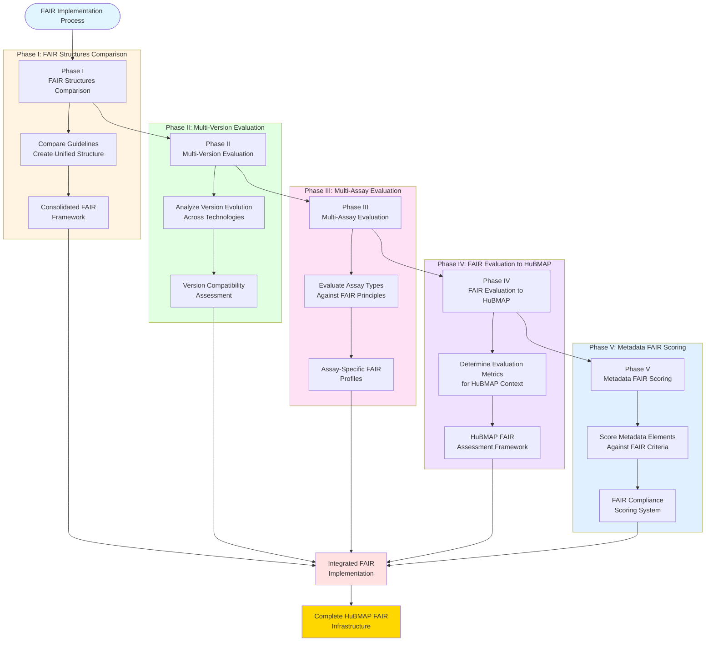

# FAIR Implementation Phases Overview

## Description
Simplified overview of the five-phase FAIR implementation workflow for HuBMAP infrastructure analysis.

## Phases Overview

## Phase Breakdown

### Phase I: FAIR Structures Comparison
**Objective**: Compare and consolidate existing FAIR guidelines from multiple sources.
- **Input**: Various FAIR guidelines, frameworks, and toolkits
- **Process**: Comparison analysis and harmonization
- **Output**: Unified FAIR framework structure

### Phase II: Multi-Version Evaluation  
**Objective**: Analyze how different versions affect FAIR compliance across technologies.
- **Input**: Version histories of assay pipelines and standards
- **Process**: Version evolution tracking and compatibility assessment
- **Output**: Version management framework with compatibility matrices

### Phase III: Multi-Assay Evaluation
**Objective**: Evaluate different assay types against FAIR principles.
- **Input**: HuBMAP assay technologies (scRNA-seq, imaging, spatial, etc.)
- **Process**: Assay-specific FAIR compliance analysis
- **Output**: Technology-specific FAIR profiles and best practices

### Phase IV: FAIR Evaluation to HuBMAP
**Objective**: Develop evaluation metrics tailored to HuBMAP ecosystem.
- **Input**: HuBMAP datasets, metadata, and infrastructure requirements
- **Process**: Metric development and validation testing
- **Output**: HuBMAP-specific FAIR assessment framework

### Phase V: Metadata FAIR Scoring
**Objective**: Create scoring system for metadata FAIR compliance.
- **Input**: Metadata schemas and data element specifications  
- **Process**: Scoring algorithm development and calibration
- **Output**: Automated FAIR compliance scoring system

## Integration Strategy

All five phases converge to create a comprehensive FAIR implementation framework that provides:
- **Unified Standards**: Harmonized guidelines applicable across contexts
- **Version Management**: Framework for handling technology evolution
- **Technology Profiles**: Assay-specific implementation guidance  
- **Assessment Tools**: HuBMAP-tailored evaluation metrics
- **Scoring System**: Quantitative compliance measurement

## Expected Outcome

A complete, operationalized FAIR infrastructure for HuBMAP that enables systematic assessment, improvement, and maintenance of data FAIR compliance across all tissue mapping technologies and workflows.