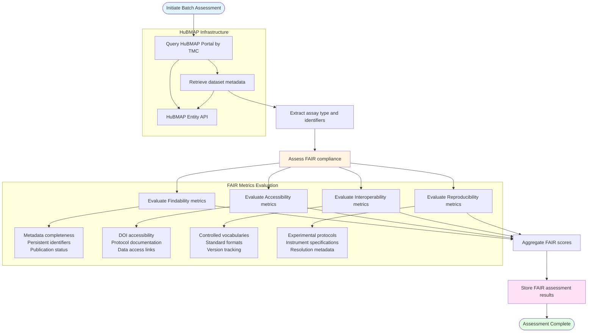

# HuBMAP Dataset FAIR Assessment Pipeline

## Description
Batch processing workflow for collecting HuBMAP tissue mapping datasets from multiple Tissue Mapping Centers, evaluating FAIR compliance metrics, and storing assessment results for downstream analysis.

## FAIR Assessment Pipeline

## Pipeline Stages

1. **Dataset Discovery**: Query HuBMAP portal for datasets from Tissue Mapping Centers
2. **Metadata Retrieval**: Extract comprehensive metadata for each dataset
3. **FAIR Assessment**: Evaluate datasets against FAIR principles (Findable, Accessible, Interoperable, Reproducible)
4. **Results Storage**: Archive FAIR scores for comparative analysis and visualization
