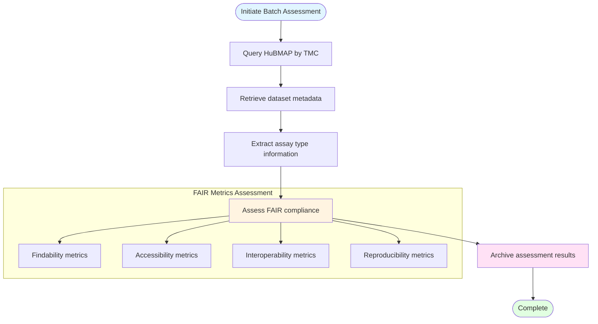

# HuBMAP Batch FAIR Assessment

## Description
Batch processing workflow for querying HuBMAP Tissue Mapping Centers, retrieving dataset metadata, and performing comprehensive FAIR compliance assessment.

## Assessment Workflow

## Workflow Steps

1. **Query TMC**: Search HuBMAP portal for datasets by Tissue Mapping Center
2. **Retrieve Metadata**: Extract comprehensive dataset information
3. **Assess FAIR**: Evaluate compliance across four FAIR dimensions
4. **Archive**: Store assessment results for analysis
