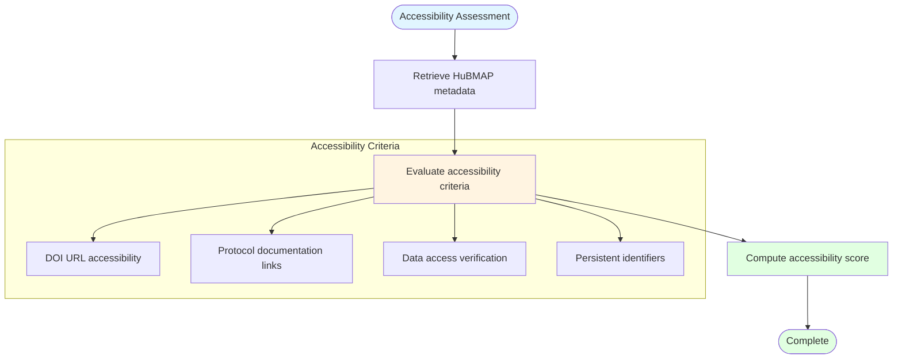

# FAIR Accessibility Assessment

## Description
Evaluation of dataset accessibility through DOI validation, protocol documentation verification, and data access link assessment for HuBMAP datasets.

## Accessibility Metrics

## Assessment Criteria

- **DOI Validation**: Verify registered DOI and protocol DOI accessibility
- **Protocol Documentation**: Check availability of protocols.io documentation
- **Data Access**: Validate data access links and identifiers
- **Persistent Identifiers**: Ensure proper dataset and group identifiers
