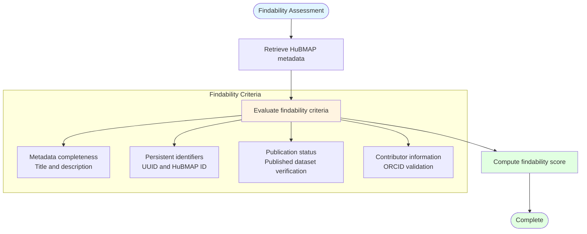

# FAIR Findability Assessment

## Description
Evaluation of dataset findability through metadata completeness, persistent identifier validation, publication status verification, and contributor ORCID validation for HuBMAP datasets.

## Findability Metrics

## Assessment Criteria

- **Metadata Quality**: Completeness of dataset title, description, and metadata fields
- **Persistent Identifiers**: Validation of UUID and HuBMAP dataset identifiers
- **Publication Status**: Verification that dataset is published and accessible
- **Contributor Validation**: ORCID validation for dataset contributors and contacts
