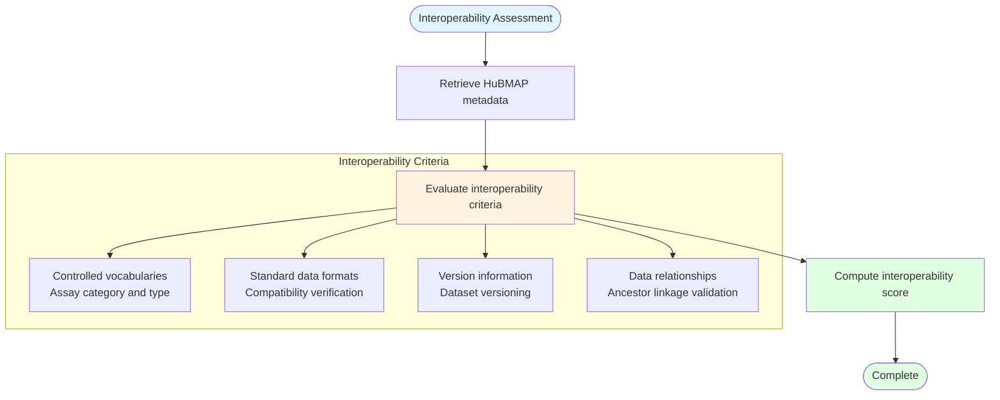

# FAIR Interoperability Assessment

## Description
Evaluation of dataset interoperability through controlled vocabulary validation, assay type standardization, version tracking, and data relationship verification for HuBMAP datasets.

## Interoperability Metrics

## Assessment Criteria

- **Controlled Vocabularies**: Validation of assay category (imaging/sequence) and assay type against standard terms
- **Standard Formats**: Verification of data format compatibility and standardization
- **Version Tracking**: Assessment of dataset version information and tracking
- **Data Relationships**: Validation of dataset ancestor relationships and linkages
