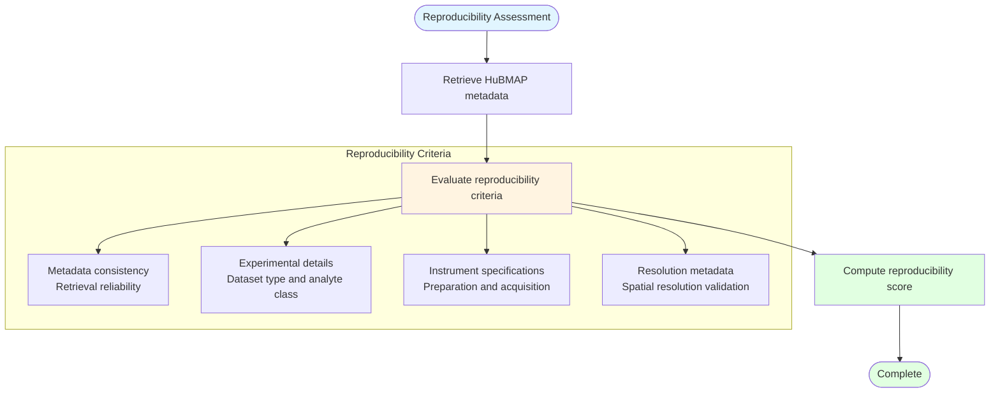

# FAIR Reproducibility Assessment

## Description
Evaluation of dataset reproducibility through metadata consistency validation, experimental detail verification, instrument specification assessment, and resolution metadata validation for HuBMAP datasets.

## Reproducibility Metrics

## Assessment Criteria

- **Metadata Consistency**: Validation of reliable metadata retrieval and consistency
- **Experimental Details**: Verification of dataset type, analyte class, and experimental parameters
- **Instrument Specifications**: Assessment of preparation instrument kit and acquisition instrument model
- **Resolution Metadata**: Validation of spatial resolution (X, Y, Z) units and values for imaging datasets
