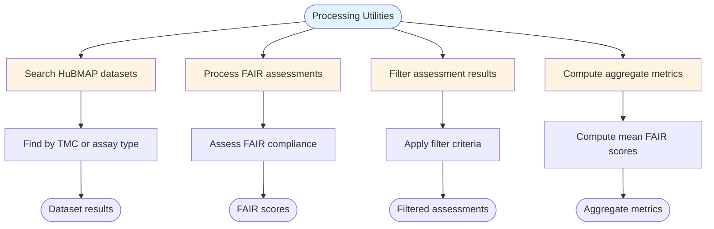

# FAIR Assessment Processing Utilities

## Description
Utility functions for HuBMAP dataset discovery, FAIR assessment processing, result filtering, and aggregate score computation.

## Processing Utilities

## Utility Functions

- **Search Datasets**: Query HuBMAP portal by Tissue Mapping Center or assay type
- **Process FAIR**: Perform comprehensive FAIR compliance assessment
- **Filter Results**: Apply multi-criteria filters to assessment results
- **Aggregate Scores**: Compute mean FAIR metrics for dataset groups
