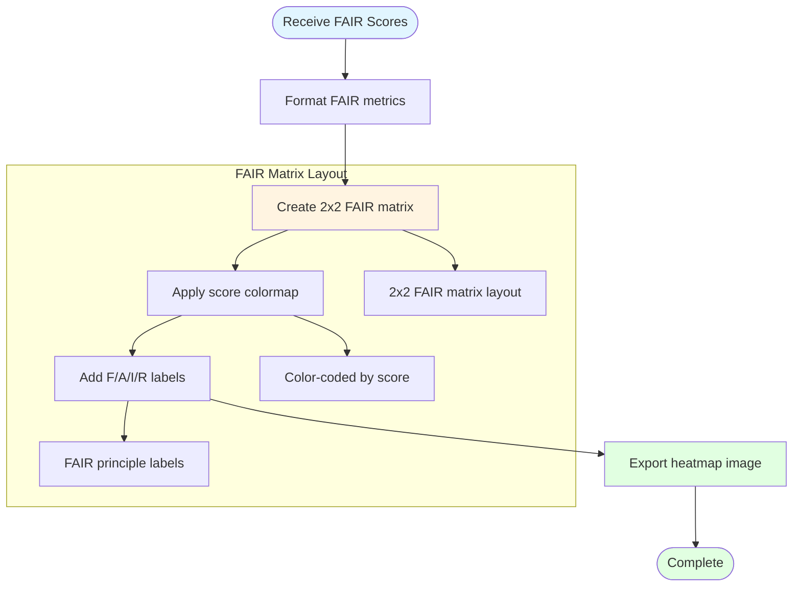

# FAIR Heatmap Visualization

## Description
Generation of 2x2 FAIR compliance heatmaps showing Findable, Accessible, Interoperable, and Reproducible metrics for HuBMAP datasets.

## Visualization Generation

## Visualization Process

1. **Format Scores**: Prepare FAIR metrics for visualization
2. **Create Matrix**: Generate 2x2 layout with FAIR dimensions
3. **Apply Colormap**: Color-code by compliance score
4. **Export**: Save as publication-ready image
