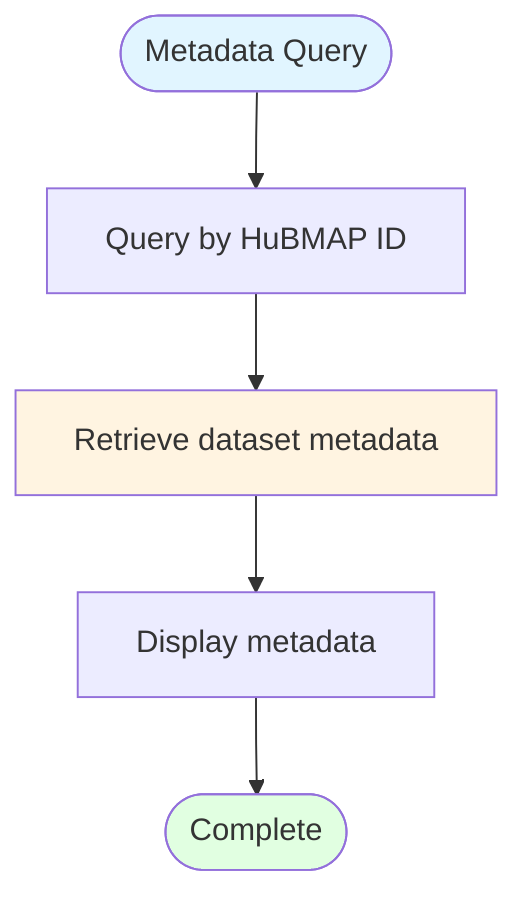

# HuBMAP Metadata Retrieval

## Description
Retrieval of comprehensive metadata for a specific HuBMAP tissue mapping dataset from the Entity API.

## Metadata Retrieval

## Retrieval Process

1. **Query**: Specify HuBMAP dataset identifier
2. **Retrieve**: Fetch comprehensive metadata from HuBMAP Entity API
3. **Display**: Present dataset information including assay type, identifiers, and metadata
