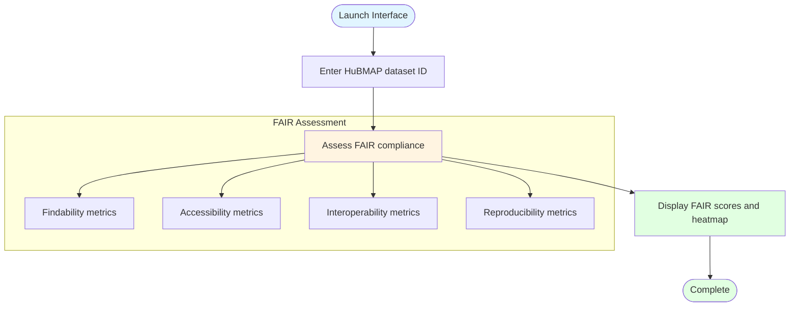

# Single Dataset FAIR Assessment Interface

## Description
Web-based interface for real-time FAIR compliance assessment of individual HuBMAP datasets with immediate visualization.

## Assessment Interface

## Assessment Workflow

1. **Enter ID**: User provides HuBMAP dataset identifier
2. **Assess FAIR**: System evaluates compliance across four FAIR dimensions
3. **Display**: Show FAIR scores and 2x2 heatmap visualization
