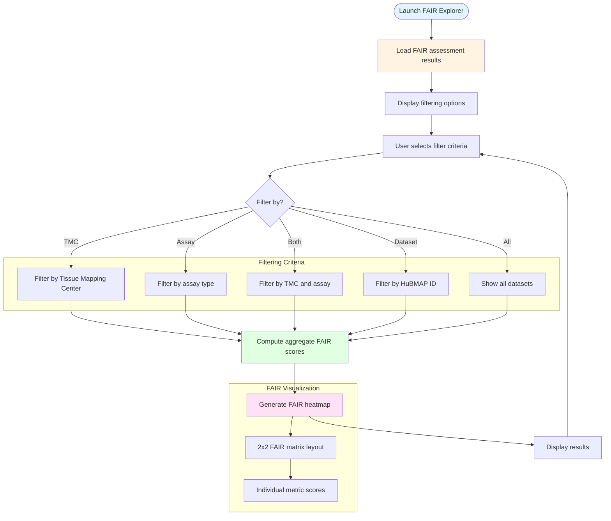

# HuBMAP FAIR Score Visualization Interface

## Description
Interactive web application for exploring and visualizing FAIR compliance scores across HuBMAP datasets with filtering by Tissue Mapping Center, assay type, and dataset identifiers.

## FAIR Score Explorer Interface

## Interface Features

- **Multi-criteria Filtering**: Filter by Tissue Mapping Center, assay type, or specific HuBMAP dataset ID
- **Aggregate Analysis**: Compute mean FAIR scores across filtered datasets
- **FAIR Heatmap Visualization**: Generate 2x2 matrix showing Findable, Accessible, Interoperable, and Reproducible scores
- **Interactive Exploration**: Dynamically adjust filters to compare FAIR compliance across different dataset subsets
