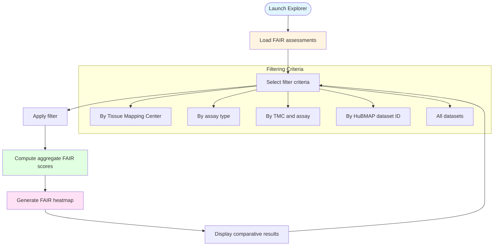

# HuBMAP FAIR Score Comparative Explorer

## Description
Advanced interactive interface for comparative analysis of FAIR compliance scores across HuBMAP datasets with multi-criteria filtering and aggregate visualization.

## Comparative Explorer

## Explorer Features

- **Multi-criteria Filtering**: Filter by Tissue Mapping Center, assay type, or specific HuBMAP dataset
- **Aggregate Analysis**: Compute mean FAIR scores across filtered dataset subsets
- **Comparative Visualization**: Generate FAIR heatmaps for comparative analysis
- **Interactive Exploration**: Dynamically adjust filters to compare compliance patterns
