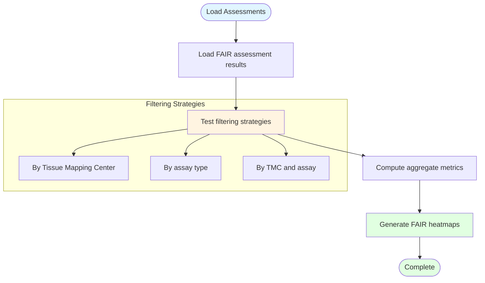

# FAIR Assessment Filtering Examples

## Description
Demonstration of various filtering strategies for exploring FAIR compliance patterns across HuBMAP datasets by Tissue Mapping Center and assay type.

## Filtering Workflow

## Filtering Process

1. **Load**: Load precomputed FAIR assessment results
2. **Test Filters**: Apply different filtering criteria (TMC, assay type, combinations)
3. **Compute Aggregate**: Calculate mean FAIR scores for filtered subsets
4. **Visualize**: Generate comparative FAIR heatmap visualizations
