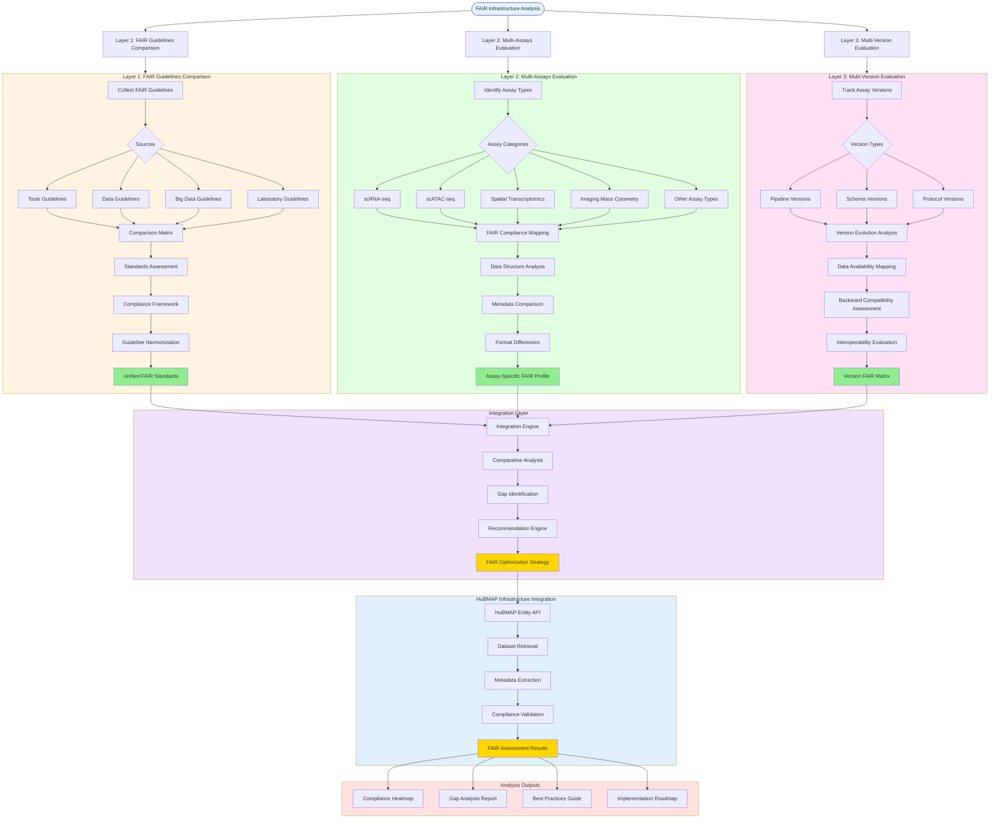

# FAIR Infrastructure Analysis Overview

## Description
Comprehensive infrastructure analysis evaluating FAIR guidelines implementation for HuBMAP through three interconnected evaluation layers: guidelines comparison, multi-assays assessment, and multi-version analysis.

## Infrastructure Analysis Architecture

## Analysis Framework

### Layer 1: FAIR Guidelines Comparison
**Objective**: Systematically evaluate and compare existing FAIR guidelines from diverse sources to establish comprehensive compliance standards.

#### Paper Evaluation Process
- **Literature Collection**: Gather FAIR guidelines from academic papers, tools documentation, big data initiatives, and laboratory protocols
- **Source Categorization**: Classify guidelines by domain (tools, datasets, infrastructure, workflows)
- **Comparison Matrix**: Cross-reference compliance requirements across different guideline sources
- **Standards Assessment**: Evaluate consistency and gaps between different FAIR interpretations

#### Guideline Harmonization
- **Convergence Analysis**: Identify common elements across different FAIR approaches
- **Conflict Resolution**: Address contradictory recommendations between guideline sources
- **Unified Standards**: Develop harmonized FAIR criteria applicable to HuBMAP context

### Layer 2: Multi-Assays Evaluation
**Objective**: Analyze how different assay types within HuBMAP align with FAIR principles, considering unique data characteristics and metadata requirements.

#### Assay Type Assessment
- **Technology Coverage**: Include major HuBMAP assays (scRNA-seq, scATAC-seq, Spatial Transcriptomics, Imaging Mass Cytometry)
- **Data Structure Analysis**: Compare metadata schemas, file formats, and data organization patterns
- **FAIR Compliance Mapping**: Evaluate each assay type against harmonized FAIR criteria
- **Best Practices Identification**: Document assay-specific FAIR optimization strategies

#### Comparative Analysis
- **Metadata Completeness**: Assess information richness across assay types
- **Accessibility Patterns**: Compare data sharing mechanisms and access protocols
- **Interoperability Challenges**: Identify integration barriers between assay types
- **Reproducibility Requirements**: Evaluate computational reproducibility needs per assay

### Layer 3: Multi-Version Evaluation
**Objective**: Track evolution of assay implementations across versions and assess impact on FAIR compliance and data interoperability.

#### Version Evolution Tracking
- **Pipeline Versioning**: Monitor changes in data processing workflows
- **Schema Evolution**: Track metadata schema updates and extensions
- **Protocol Changes**: Document modifications in experimental protocols
- **Data Availability**: Map what data elements are available across versions

#### Compatibility Assessment
- **Backward Compatibility**: Evaluate ability to process older datasets with newer pipelines
- **Forward Compatibility**: Assess newer datasets' compatibility with established analysis workflows
- **Cross-Version Interoperability**: Analyze data integration feasibility across versions
- **Migration Strategies**: Develop approaches for version transitions

## Integration and Outputs

### Comprehensive Analysis Engine
The integration layer synthesizes findings from all three evaluation layers to provide:
- **Gap Analysis**: Identify specific areas where FAIR compliance can be improved
- **Recommendation Engine**: Generate actionable suggestions for enhancing FAIR compliance
- **Best Practices Documentation**: Compile proven strategies for FAIR implementation
- **Implementation Roadmap**: Provide structured approach for FAIR optimization

### HuBMAP Integration
Direct connection to HuBMAP infrastructure enables:
- **Real-time Assessment**: Evaluate datasets against developed FAIR criteria
- **Automated Compliance Checking**: Systematic validation of FAIR principles
- **Continuous Improvement**: Iterative refinement based on assessment results
- **Community Guidelines**: Share findings with broader HuBMAP community

## Expected Outcomes

1. **Unified FAIR Standards**: Harmonized criteria applicable across HuBMAP ecosystem
2. **Assay-Specific Profiles**: Tailored FAIR guidelines for different experimental approaches
3. **Version Management Framework**: Systematic approach to handling dataset evolution
4. **Implementation Tools**: Practical resources for improving FAIR compliance
5. **Assessment Dashboard**: Interactive visualization of FAIR compliance metrics