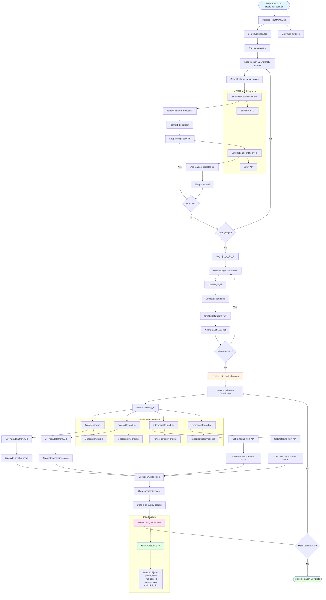

# Precomputation and Data Loading System

## Description
This diagram shows the complete precomputation pipeline that processes HuBMAP datasets, calculates FAIR scores, and stores results in `fair_results.json`. This is a batch processing system that runs offline to preload all FAIR calculations.

## Precomputation Flow Diagram

## Key Components

### Data Collection Phase
- **22 University Groups**: Hardcoded list of all participating institutions
- **SearchSdk**: Searches for datasets by group name (size: 1700 per group)
- **EntitySdk**: Retrieves full dataset metadata for each found ID
- **Rate Limiting**: 1 second sleep between API calls to avoid overwhelming the API

### Data Transformation Phase
- **Dataset Objects → DataFrames**: Converts SDK Dataset objects to pandas DataFrames
- **Attribute Extraction**: Dynamically extracts all attributes from Dataset objects
- **DataFrame List**: Creates list of DataFrames, one per dataset

### FAIR Scoring Phase
- **process_fair_multi_datastes()**: Main processing function that iterates through DataFrames
- **Four FAIR Modules**: Calls findable, accessible, interoperable, and reproducible for each dataset
- **Metadata Caching**: Each FAIR module fetches and caches metadata to JSON/ folder
- **Score Aggregation**: Collects all four scores into [F, A, I, R] array

### Storage Phase
- **Incremental Writing**: Writes JSON after processing each DataFrame (allows progress tracking)
- **JSON Structure**: Array of objects containing group_name, hubmap_id, dataset_type, and fair scores
- **Output Location**: `fair/fair_results.json`

## Performance Characteristics
- **Batch Processing**: Processes all datasets offline
- **Time Intensive**: Can take hours depending on number of datasets
- **API Dependent**: Requires network access to HuBMAP APIs
- **Incremental Saves**: Progress is saved after each DataFrame to prevent data loss
