# Research Data Normalization Process

## Description
This diagram illustrates the complete research methodology for data normalization, from FAIR guideline comparison through multi-assay and multi-version evaluation to final FAIR structure adaptation for HuBMAP.

## Research Data Normalization Flow Diagram

```mermaid
flowchart TD
    Start([Research Data Normalization Process]) --> Phase1[Phase I: FAIR Structures Comparison]
    Phase1 --> Phase2[Phase II: Multi-Assay Evaluation]
    Phase2 --> Phase3[Phase III: Multi-Version Evaluation]
    Phase3 --> Phase4[Phase IV: Merging Data Evaluation]
    Phase4 --> Phase5[Phase V: Adapting FAIR to HuBMAP]
    Phase5 --> End([Normalized FAIR Structure])
    
    subgraph Phase1["Phase I: FAIR Structures Comparison"]
        direction TB
        P1Start[Collect FAIR Resources] --> P1Frameworks[Analyze Frameworks]
        P1Start --> P1Guidelines[Review FAIR Guidelines]
        P1Start --> P1Workflows[Examine Workflows]
        P1Start --> P1Toolkits[Study Toolkits]
        
        P1Frameworks --> P1Comparative[Comparative Analysis]
        P1Guidelines --> P1Comparative
        P1Workflows --> P1Comparative
        P1Toolkits --> P1Comparative
        
        P1Comparative --> P1Evaluating[Evaluating Tool]
        P1Evaluating --> P1FinalFile[Create Final Comparison File]
        P1FinalFile --> P1Results[End Results: Standardized FAIR Structure]
    end
    
    subgraph Phase2["Phase II: Multi-Assay Evaluation"]
        direction TB
        P2Start[Load All Datasets] --> P2Scan[Scan All Datasets]
        P2Scan --> P2Extract[Extract Assay Types]
        P2Extract --> P2Identify[Identify Unique Assay Types]
        P2Identify --> P2CreateNames[Create Assay Type Names List]
        P2CreateNames --> P2Catalog[Catalog Available Assay Types]
        P2Catalog --> P2AssayList["Output: Complete Assay Type Inventory<br/>- CODEX<br/>- IMC<br/>- 10X Multiome<br/>- scRNAseq<br/>- ATACseq<br/>- etc."]
    end
    
    subgraph Phase3["Phase III: Multi-Version Evaluation"]
        direction TB
        P3Start[For Each Assay Type] --> P3Group[Group by Assay Type]
        P3Group --> P3IdentifyVersions[Identify All Versions]
        P3IdentifyVersions --> P3VersionList["Version Examples:<br/>- scRNAseq-10xGenomics-v2<br/>- scRNAseq-10xGenomics-v3<br/>- snRNAseq-10xGenomics-v3"]
        
        P3VersionList --> P3Verify[Verify Data Availability]
        P3Verify --> P3CheckFields[Check Available Fields per Version]
        P3CheckFields --> P3MapFields[Map Fields Across Versions]
        P3MapFields --> P3VersionMatrix["Output: Version Comparison Matrix<br/>Fields available in each version"]
        
        P3VersionMatrix --> P3MoreAssays{More Assay Types?}
        P3MoreAssays -->|Yes| P3Start
        P3MoreAssays -->|No| P3Complete[All Versions Evaluated]
    end
    
    subgraph Phase4["Phase IV: Merging Data Evaluation"]
        direction TB
        P4Start[Analyze Common Features] --> P4PerAssay[For Each Assay Type]
        P4PerAssay --> P4AcrossVersions[Across All Versions]
        P4AcrossVersions --> P4IdentifyCommon[Identify Common Features]
        
        P4IdentifyCommon --> P4Categorize[Categorize Features]
        P4Categorize --> P4AlwaysRequired[Always Required Features]
        P4Categorize --> P4ConditionalRequired[Conditional Required Features]
        P4Categorize --> P4Optional[Optional Features]
        
        P4AlwaysRequired --> P4BaseRequirements[Base Requirements Set]
        P4ConditionalRequired --> P4ConditionalRules[Conditional Rules:<br/>Required for some assay types<br/>Optional for others]
        P4Optional --> P4OptionalSet[Optional Features Set]
        
        P4BaseRequirements --> P4Merge[Create Global Version]
        P4ConditionalRules --> P4Merge
        P4OptionalSet --> P4Merge
        
        P4Merge --> P4GlobalStructure["Output: Global Merged Structure<br/>- Always Required<br/>- Conditional Required<br/>- Optional"]
        
        P4GlobalStructure --> P4MoreAssays{More Assay Types?}
        P4MoreAssays -->|Yes| P4PerAssay
        P4MoreAssays -->|No| P4Complete[All Assays Merged]
    end
    
    subgraph Phase5["Phase V: Adapting FAIR to HuBMAP"]
        direction TB
        P5Start[Take Global Merged Structure] --> P5MapFAIR[Map to FAIR Categories]
        P5MapFAIR --> P5Findable[Findable Category]
        P5MapFAIR --> P5Accessible[Accessible Category]
        P5MapFAIR --> P5Interoperable[Interoperable Category]
        P5MapFAIR --> P5Reproducible[Reproducible Category]
        
        P5Findable --> P5EvaluateMetric[Evaluate Metric]
        P5Accessible --> P5EvaluateMetric
        P5Interoperable --> P5EvaluateMetric
        P5Reproducible --> P5EvaluateMetric
        
        P5EvaluateMetric --> P5DetermineCategory[Determine FAIR Category]
        P5DetermineCategory --> P5AssignScore[Assign Scoring Logic]
        P5AssignScore --> P5HuBMAPStructure["Output: HuBMAP-Adapted FAIR Structure<br/>- Metric Evaluation Rules<br/>- Category Assignments<br/>- Scoring Criteria"]
    end
    
    P1Results --> P2Start
    P2AssayList --> P3Start
    P3Complete --> P4Start
    P4Complete --> P5Start
    P5HuBMAPStructure --> End
    
    subgraph "Data Sources"
        DS1[FAIR Frameworks]
        DS2[FAIR Guidelines]
        DS3[FAIR Workflows]
        DS4[FAIR Toolkits]
        DS5[HuBMAP Datasets]
    end
    
    P1Frameworks -.->|Input| DS1
    P1Guidelines -.->|Input| DS2
    P1Workflows -.->|Input| DS3
    P1Toolkits -.->|Input| DS4
    P2Scan -.->|Input| DS5
    
    subgraph "Output Artifacts"
        OA1[Final Comparison File]
        OA2[Assay Type Inventory]
        OA3[Version Comparison Matrix]
        OA4[Global Merged Structure]
        OA5[HuBMAP FAIR Structure]
    end
    
    P1FinalFile -.->|Produces| OA1
    P2AssayList -.->|Produces| OA2
    P3VersionMatrix -.->|Produces| OA3
    P4GlobalStructure -.->|Produces| OA4
    P5HuBMAPStructure -.->|Produces| OA5
    
    style Phase1 fill:#e1f5ff
    style Phase2 fill:#fff4e1
    style Phase3 fill:#e1ffe1
    style Phase4 fill:#ffe1f5
    style Phase5 fill:#f0e1ff
    style Start fill:#f0f0f0
    style End fill:#e1ffe1
    style P1Comparative fill:#fff4e1
    style P4Merge fill:#ffe1f5
    style P5EvaluateMetric fill:#f0e1ff
```

## Phase Details

### Phase I: FAIR Structures Comparison
**Objective**: Compare and synthesize different FAIR guidelines to create a standardized structure

**Components**:
- **Frameworks**: Analyze existing FAIR frameworks (e.g., GO-FAIR, RDA)
- **FAIR Guidelines**: Review official FAIR principles and guidelines
- **Workflows**: Examine FAIR implementation workflows
- **Toolkits**: Study available FAIR assessment toolkits
- **Comparative Analysis**: Compare similarities and differences
- **Evaluating Tool**: Develop or select evaluation methodology
- **Output**: Final comparison file with standardized FAIR structure

**Key Activities**:
- Literature review and framework analysis
- Cross-reference different FAIR interpretations
- Identify common patterns and requirements
- Document differences and variations

### Phase II: Multi-Assay Evaluation
**Objective**: Identify and catalog all available assay types across datasets

**Components**:
- **Dataset Scanning**: Process all available datasets
- **Assay Type Extraction**: Identify assay type metadata
- **Name Creation**: Standardize assay type naming conventions
- **Cataloging**: Create comprehensive inventory

**Output**: Complete list of assay types (e.g., CODEX, IMC, 10X Multiome, scRNAseq, ATACseq, seqFISH, etc.)

**Key Activities**:
- Extract `dataset_type` or `assay_type` fields
- Normalize naming conventions
- Remove duplicates
- Create master inventory

### Phase III: Multi-Version Evaluation
**Objective**: For each assay type, identify all versions and verify data availability

**Components**:
- **Version Identification**: Find all versions of each assay type
- **Data Verification**: Check what data/fields are available in each version
- **Field Mapping**: Map available fields across versions
- **Version Matrix**: Create comparison matrix

**Example Versions**:
- scRNAseq-10xGenomics-v2
- scRNAseq-10xGenomics-v3
- snRNAseq-10xGenomics-v3
- ATACseq-bulk vs snATACseq vs sciATACseq

**Output**: Version comparison matrix showing field availability per version

**Key Activities**:
- Group datasets by assay type
- Identify version variations
- Extract available metadata fields per version
- Compare field availability across versions

### Phase IV: Merging Data Evaluation
**Objective**: Create a global merged structure by identifying common features across versions and assay types

**Components**:
- **Common Feature Identification**: Find features present across versions
- **Feature Categorization**: Classify features into three types:
  - **Always Required**: Features present in all assay types and versions
  - **Conditional Required**: Required for some assay types, optional for others
  - **Optional**: Features that may or may not be present
- **Global Structure Creation**: Merge base requirements with conditional rules

**Output**: Global merged structure with:
- Base requirements (always required)
- Conditional requirements (assay-type specific)
- Optional features

**Key Activities**:
- Intersection analysis across versions
- Union analysis across assay types
- Feature dependency mapping
- Requirement prioritization

### Phase V: Adapting FAIR to HuBMAP
**Objective**: Map the global structure to FAIR categories and create evaluation metrics

**Components**:
- **FAIR Category Mapping**: Assign features to Findable, Accessible, Interoperable, Reproducible
- **Metric Evaluation**: Determine how to evaluate each metric
- **Category Determination**: Decide which FAIR category each feature belongs to
- **Scoring Logic**: Define scoring criteria for each metric

**Output**: HuBMAP-adapted FAIR structure with:
- Metric evaluation rules
- Category assignments
- Scoring criteria per metric

**Key Activities**:
- Map features to FAIR principles
- Define evaluation criteria
- Create scoring algorithms
- Document category assignments

## Data Flow Summary

1. **Phase I → Phase II**: Standardized FAIR structure guides assay type evaluation
2. **Phase II → Phase III**: Assay type list enables version analysis
3. **Phase III → Phase IV**: Version comparison enables feature merging
4. **Phase IV → Phase V**: Global structure enables FAIR adaptation
5. **Phase V → End**: Final HuBMAP-adapted FAIR structure

## Key Deliverables

1. **Final Comparison File**: Standardized FAIR structure from Phase I
2. **Assay Type Inventory**: Complete list of available assay types
3. **Version Comparison Matrix**: Field availability across versions
4. **Global Merged Structure**: Unified structure with feature categorization
5. **HuBMAP FAIR Structure**: Final adapted structure with evaluation metrics

## Research Methodology

This process follows a systematic approach:
- **Top-down**: Start with general FAIR principles
- **Bottom-up**: Analyze specific datasets and assay types
- **Synthesis**: Merge findings into unified structure
- **Adaptation**: Customize for HuBMAP context
