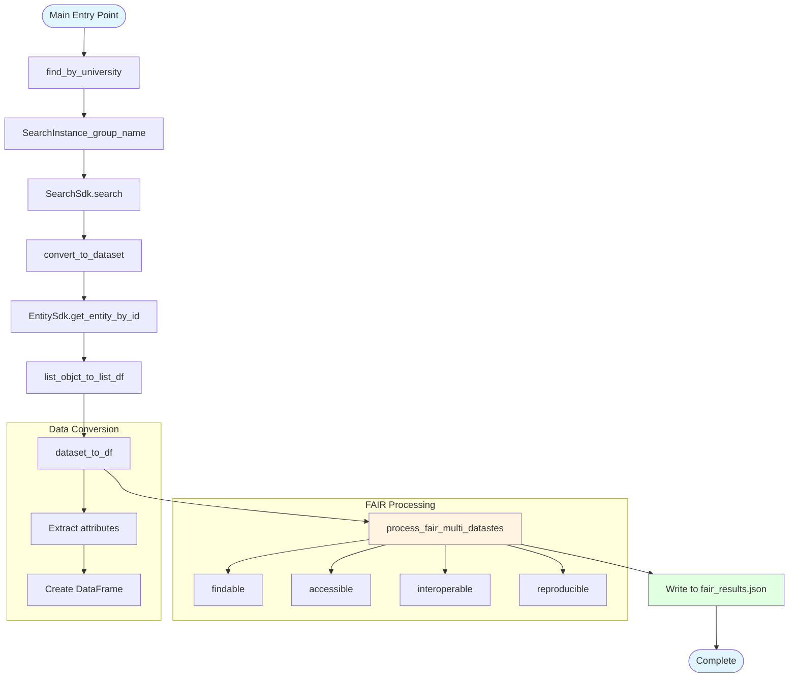

# create_fair_json.py - Diagram

## Description
Batch processing pipeline that searches for datasets by university group names, converts them to DataFrames, processes FAIR scores, and writes results to JSON.

## Flow Diagram

## Key Components

- **find_by_university()**: Searches for datasets by university group names using SearchSdk
- **convert_to_dataset()**: Converts search query results to Dataset objects using EntitySdk
- **list_objct_to_list_df()**: Converts list of Dataset objects to list of DataFrames
- **dataset_to_df()**: Converts a single Dataset object to a DataFrame row
- **process_fair_multi_datastes()**: Processes FAIR scores for multiple datasets (imported from fair.utils)
- **Main flow**: Orchestrates the entire batch processing pipeline and writes results to JSON
