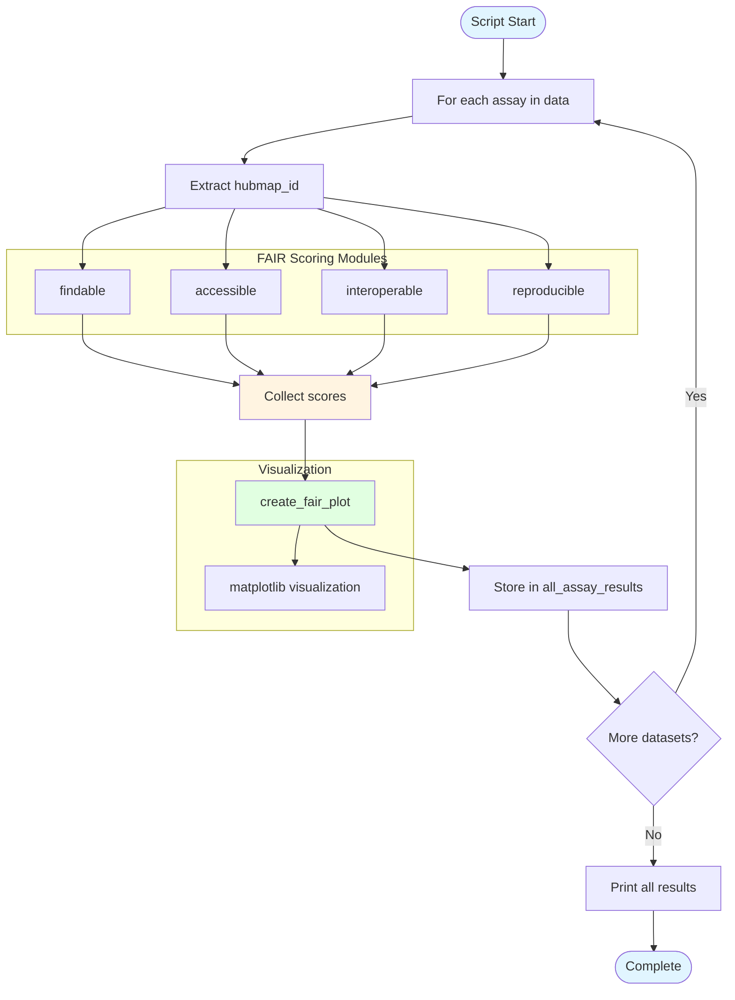

# example.py - Diagram

## Description
Example script demonstrating single dataset FAIR scoring. Loops through datasets, calculates FAIR scores for each, and generates visualization plots.

## Flow Diagram

## Key Components

- **Data dictionary**: Contains assay types and their corresponding HuBMAP IDs
- **FAIR scoring functions**: Calls findable, accessible, interoperable, and reproducible from fair modules
- **create_fair_plot()**: Generates 2x2 heatmap visualization of FAIR scores (imported from fairhelp)
- **Result collection**: Stores tuples of (assay, hubmap_id, scores) for all processed datasets
