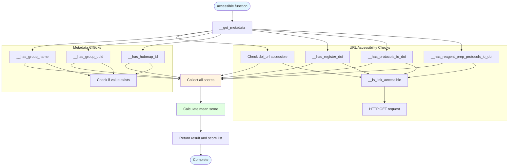

# fair/accessible.py - Diagram

## Description
Accessible scoring module that evaluates dataset accessibility based on 7 criteria including DOI URLs, group information, and protocol accessibility.

## Flow Diagram

## Key Components

- **accessible()**: Main function that calculates accessibility score (0-1)
- **__is_link_accessible()**: Checks if a URL is accessible via HTTP request
- **__has_group_name()**: Verifies group_name exists in metadata
- **__has_group_uuid()**: Verifies group_uuid exists in metadata
- **__has_hubmap_id()**: Verifies hubmap_id exists in metadata
- **__has_register_doi()**: Checks if registered DOI exists and is accessible
- **__has_protocols_io_doi()**: Checks if protocols.io DOI exists and is accessible
- **__has_reagent_prep_protocols_io_doi()**: Checks if reagent prep protocol DOI exists and is accessible
- **Score calculation**: Returns mean of all 7 accessibility criteria checks
