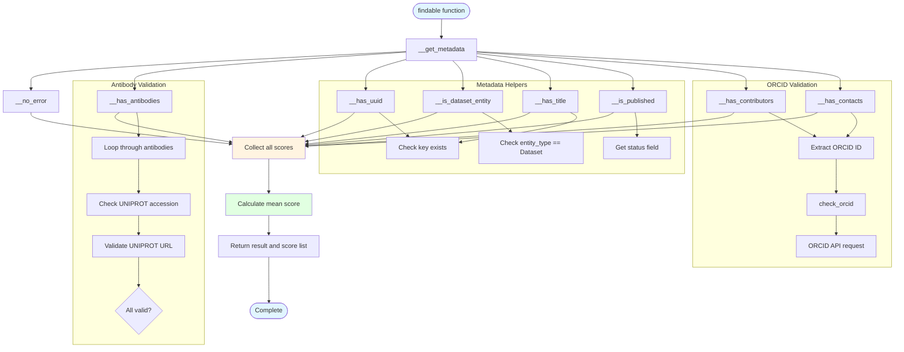

# fair/findable.py - Diagram

## Description
Findable scoring module that evaluates dataset findability based on 8 criteria including metadata quality, identifiers, publication status, and contributor information.

## Flow Diagram

## Key Components

- **findable()**: Main function that calculates findability score (0-1)
- **__get_metadata()**: Retrieves metadata from HuBMAP Entity API and caches to JSON
- **__no_error()**: Checks if metadata retrieval was successful (no error field)
- **__has_antibodies()**: Validates antibodies against UNIPROT database
- **__has_uuid()**: Verifies UUID exists in metadata
- **__is_dataset_entity()**: Verifies entity_type is "Dataset"
- **__has_title()**: Verifies title exists in metadata
- **__is_published()**: Checks if dataset status is "Published"
- **__has_contributors()**: Validates contributors exist and have valid ORCID
- **__has_contacts()**: Validates contacts exist and have valid ORCID
- **check_orcid()**: Validates ORCID ID against ORCID API
- **Score calculation**: Returns mean of all 8 findability criteria checks
