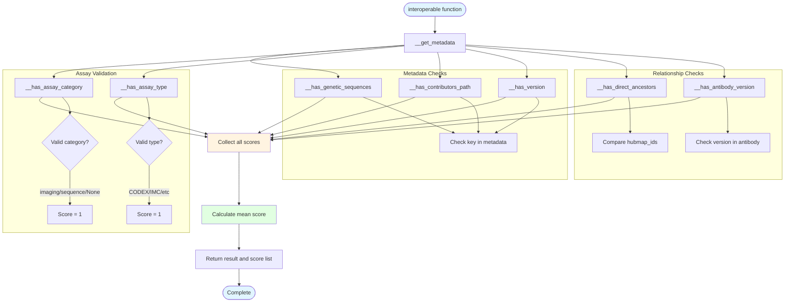

# fair/interoperable.py - Diagram

## Description
Interoperable scoring module that evaluates dataset interoperability based on 7 criteria including genetic sequences, assay information, versioning, and antibody metadata.

## Flow Diagram

## Key Components

- **interoperable()**: Main function that calculates interoperability score (0-1)
- **__has_genetic_sequences()**: Checks if contains_human_genetic_sequences field exists
- **__has_assay_category()**: Validates assay_category is one of: imaging, sequence, or None
- **__has_assay_type()**: Validates assay_type against predefined list of valid types
- **__has_contributors_path()**: Verifies contributors_path exists in metadata
- **__has_version()**: Verifies version field exists in metadata
- **__has_direct_ancestors()**: Validates direct_ancestors relationship consistency
- **__has_antibody_version()**: Checks if antibodies have version information
- **Score calculation**: Returns mean of all 7 interoperability criteria checks
