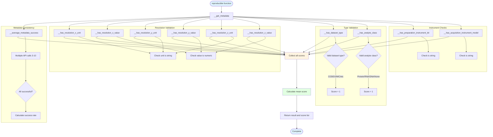

# fair/reproducible.py - Diagram

## Description
Reproducible scoring module that evaluates dataset reproducibility based on 11 criteria including metadata consistency, resolution information, dataset type, and instrument details.

## Flow Diagram

## Key Components

- **reproducible()**: Main function that calculates reproducibility score (0-1)
- **__average_metadata_success()**: Tests metadata retrieval consistency with multiple API calls (3-10 trials)
- **Resolution checks**: Validates X, Y, Z resolution units (strings) and values (numeric)
  - **__has_resolution_x/y/z_unit()**: Checks unit is valid string type
  - **__has_resolution_x/y/z_value()**: Checks value is numeric (float-convertible)
- **__has_dataset_type()**: Validates dataset_type against extensive list of valid types
- **__has_analyte_class()**: Validates analyte_class is one of: Protein, RNA, DNA, or None
- **__has_preparation_instrument_kit()**: Verifies preparation_instrument_kit is a string
- **__has_acquisition_instrument_model()**: Verifies acquisition_instrument_model is a string
- **Score calculation**: Returns mean of all 11 reproducibility criteria checks
