# fair/utils.py - Diagram

## Description
Utility module providing dataset search, FAIR score processing, filtering, and aggregation functions. Handles interactions with HuBMAP SDKs and data processing workflows.

## Flow Diagram

```mermaid
flowchart TD
    Start([Function Call]) --> RouteFunction{Which function?}
    
    RouteFunction -->|Search| SearchFunctions[Search Functions]
    RouteFunction -->|Process| ProcessFunctions[Processing Functions]
    RouteFunction -->|Filter| FilterFunctions[Filter Functions]
    RouteFunction -->|Utility| UtilityFunctions[Utility Functions]
    
    subgraph "Search Functions"
        SearchFunctions --> SearchByDataType[SearchInstance_data_type]
        SearchFunctions --> SearchByGroup[SearchInstance_group_name]
        SearchByDataType --> ConvertDataset[convert_to_dataset]
        SearchByGroup --> ConvertDataset
        ConvertDataset --> SearchAPI[SearchSdk.search]
        SearchAPI --> EntityAPI[EntitySdk.get_entity_by_id]
    end
    
    subgraph "Processing Functions"
        ProcessFunctions --> ProcessFAIR[process_fair_multi_datastes]
        ProcessFAIR --> LoopDatasets[Loop through datasets]
        LoopDatasets --> CalcFindable[findable]
        LoopDatasets --> CalcAccessible[accessible]
        LoopDatasets --> CalcInteroperable[interoperable]
        LoopDatasets --> CalcReproducible[reproducible]
        CalcFindable --> StoreResults[Store FAIR results]
        CalcAccessible --> StoreResults
        CalcInteroperable --> StoreResults
        CalcReproducible --> StoreResults
    end
    
    subgraph "Filter Functions"
        FilterFunctions --> FilterByLab[search_by_lab]
        FilterFunctions --> FilterByAssay[search_by_assay]
        FilterFunctions --> FilterByBoth[search_by_lab_assay]
        FilterFunctions --> FilterByID[search_by_id]
        FilterFunctions --> FilterAll[search_all_id]
        FilterByLab --> FindResults[find_fair_results]
        FilterByAssay --> FindResults
        FilterByBoth --> FindResults
        FilterByID --> FindResults
        FilterAll --> FindResults
    end
    
    subgraph "Aggregation Functions"
        FindResults --> MeanResults[mean_fair_results]
        MeanResults --> CalcMean[Calculate mean F/A/I/R]
        CalcMean --> CreateHeatmap[create_heatmap_for]
    end
    
    subgraph "Utility Functions"
        UtilityFunctions --> ReadJSON[read_json_fair]
        UtilityFunctions --> GroupList[group_list]
        UtilityFunctions --> TypeList[type_list]
        UtilityFunctions --> NamesGroupList[names_group_list]
        ReadJSON --> ParseJSON[Parse JSON to DataFrame]
        GroupList --> ExtractUnique[Extract unique values]
        TypeList --> ExtractUnique
    end
    
    subgraph "Dataset Discovery"
        NamesGroupList --> FindByAssays[find_datasets_by_assays]
        FindByAssays --> CreateList[create_list]
        CreateList --> UniqueList[unique_list_names]
    end
    
    style Start fill:#e1f5ff
    style ProcessFAIR fill:#fff4e1
    style MeanResults fill:#e1ffe1
    style CreateHeatmap fill:#ffe1f5
```

## Key Components

### Search Functions
- **SearchInstance_data_type()**: Creates search query by data type
- **SearchInstance_group_name()**: Creates search query by group name
- **convert_to_dataset()**: Converts search results to Dataset objects
- **find_by_university()**: Searches datasets by university group names
- **find_datasets_by_assays()**: Searches datasets by assay types

### Processing Functions
- **process_fair_multi_datastes()**: Processes FAIR scores for multiple datasets from DataFrame
- **mean_fair_results()**: Calculates mean FAIR scores from result list

### Filter Functions
- **search_by_lab()**: Filters datasets by laboratory/group name
- **search_by_assay()**: Filters datasets by assay type
- **search_by_lab_assay()**: Filters by both lab and assay
- **search_by_id()**: Filters by HuBMAP ID
- **search_all_id()**: Returns all datasets
- **find_fair_results()**: Extracts FAIR scores from DataFrame

### Visualization
- **create_heatmap_for()**: Creates and displays FAIR heatmap in Streamlit

### Utility Functions
- **read_json_fair()**: Reads FAIR results from JSON file
- **group_list()**: Extracts unique group names from DataFrame
- **type_list()**: Extracts unique dataset types from DataFrame
- **names_group_list()**: Discovers available group names from HuBMAP API
