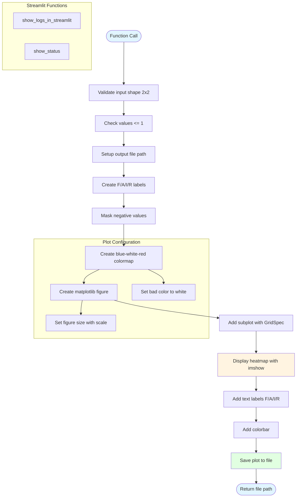

# fairhelp.py - Diagram

## Description
Helper module providing visualization utilities for FAIR scores. Creates 2x2 heatmap plots using matplotlib and provides Streamlit integration for status display.

## Flow Diagram

## Key Components

- **create_fair_plot()**: Main function that creates a 2x2 heatmap visualization
  - Validates input is 2x2 array with values <= 1
  - Creates blue-white-red colormap for score visualization
  - Labels positions as F (Findable), A (Accessible), I (Interoperable), R (Reproducible)
  - Saves plot to output directory with timestamp
  
- **show_logs_in_streamlit()**: Displays execution logs in Streamlit interface
- **show_status()**: Displays labeled status with success/error indicators in Streamlit
- **Logging setup**: Configures file and Streamlit handlers for logging
