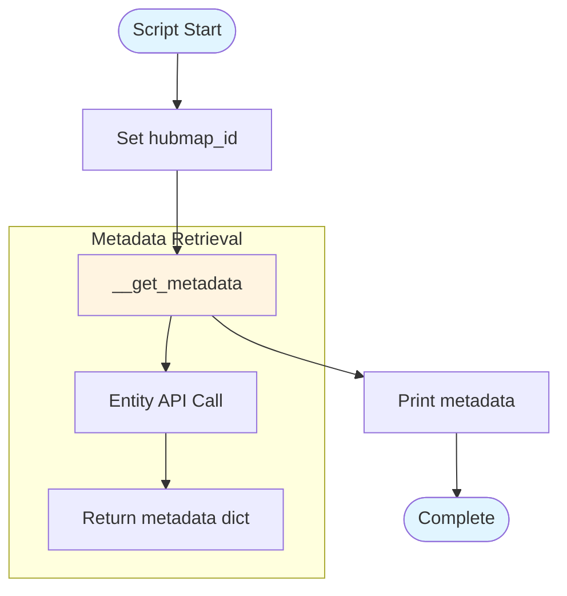

# metadata.py - Diagram

## Description
Simple example script demonstrating metadata retrieval for a HuBMAP dataset using the fairhelp module.

## Flow Diagram

## Key Components

- **hubmap_id**: Hardcoded dataset ID "HBM666.NDQZ.365"
- **__get_metadata()**: Internal function from fairhelp module that retrieves metadata from HuBMAP Entity API
- **Simple demonstration**: Shows basic usage pattern for metadata retrieval
