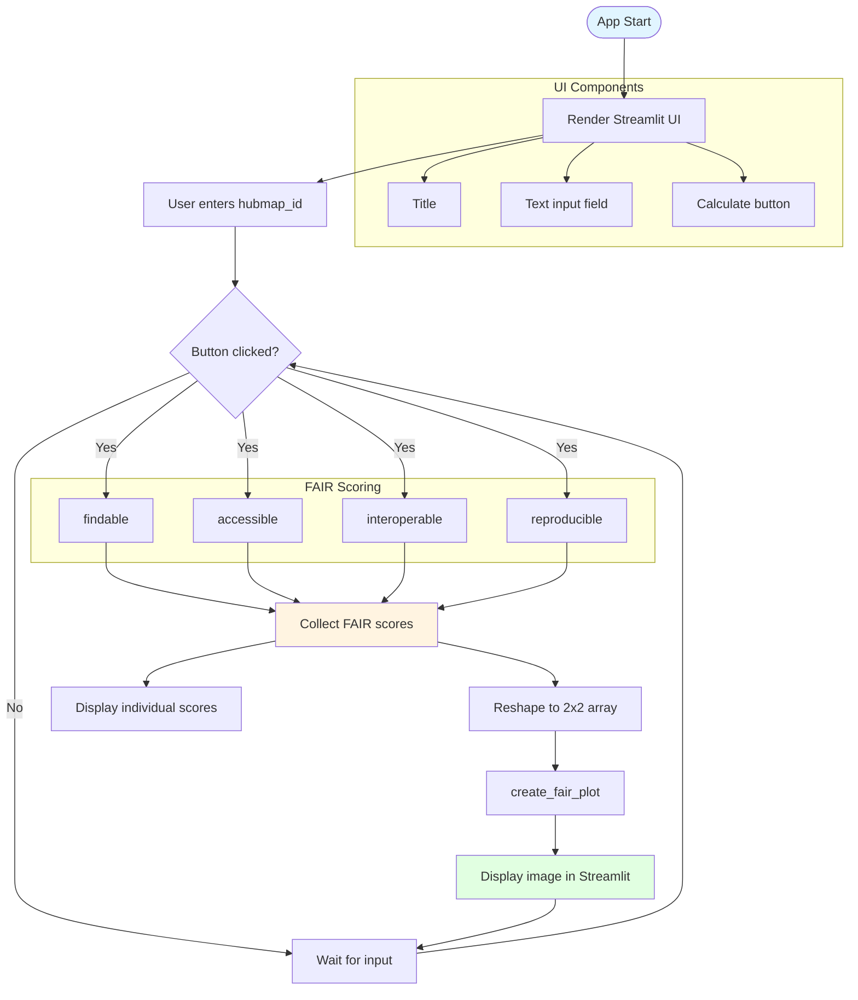

# streamlit_app.py - Diagram

## Description
Basic Streamlit web application for FAIR score visualization. Allows users to input a HuBMAP dataset ID and displays calculated FAIR scores with a heatmap visualization.

## Flow Diagram

## Key Components

- **Streamlit UI**: Simple interface with text input and button
- **FAIR score calculation**: Calls all four FAIR scoring functions (findable, accessible, interoperable, reproducible)
- **Score display**: Shows individual scores as markdown list
- **Heatmap visualization**: Creates and displays 2x2 FAIR heatmap using fairhelp.create_fair_plot()
- **Error handling**: Try-except block for graceful error handling
