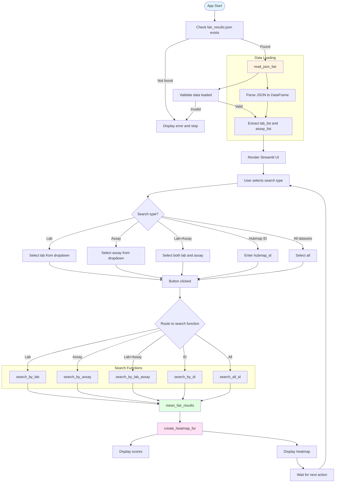

# streamlit_test.py - Diagram

## Description
Advanced Streamlit application with filtering capabilities. Loads pre-computed FAIR results from JSON, allows filtering by Lab, Assay type, Lab+Assay, or HuBMAP ID, and displays aggregated results.

## Flow Diagram

## Key Components

- **Data loading**: Reads and validates fair_results.json file at startup
- **Filter extraction**: Extracts unique lab names and assay types for dropdown menus
- **Search routing**: Routes user selection to appropriate search function
- **Aggregation**: Calculates mean FAIR scores for filtered results
- **Visualization**: Creates and displays heatmap with aggregated scores
- **Error handling**: Validates file existence and data integrity before processing
