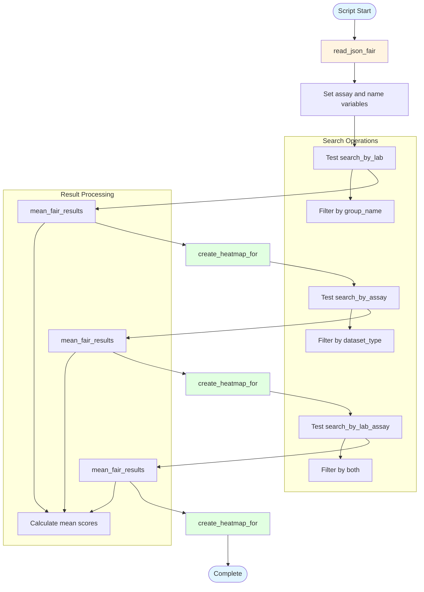

# testing_utils.py - Diagram

## Description
Testing utility script that demonstrates various search and filtering capabilities using the fair.utils module. Tests searching by lab, assay type, and combinations.

## Flow Diagram

## Key Components

- **read_json_fair()**: Loads FAIR results from JSON file
- **search_by_lab()**: Filters datasets by laboratory/group name
- **search_by_assay()**: Filters datasets by assay type
- **search_by_lab_assay()**: Filters by both lab and assay type
- **mean_fair_results()**: Calculates average FAIR scores from filtered results
- **create_heatmap_for()**: Generates and displays heatmap visualization
- **Testing pattern**: Demonstrates usage of utility functions with example parameters
