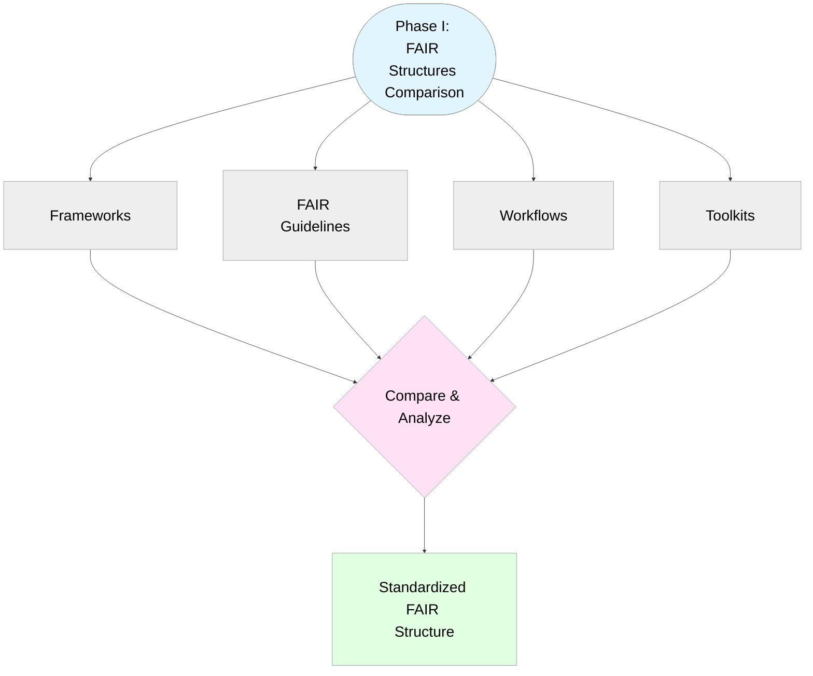

```mermaid
%%{init: {
  'theme': 'neutral',
  'themeVariables': {
    'fontSize': '32px',
    'fontFamily': 'Arial, sans-serif',
    'primaryTextColor': '#000000',
    'primaryBorderColor': '#333333',
    'lineColor': '#333333',
    'secondaryColor': '#f5f5f5',
    'tertiaryColor': '#e8e8e8'
  },
  'flowchart': {
    'nodeSpacing': 100,
    'rankSpacing': 120,
    'curve': 'basis',
    'padding': 50,
    'htmlLabels': true
  }
}}%%
flowchart TD
    Start([Phase I: FAIR Structures Comparison]) --> P1Framework[Frameworks]
    Start --> P1Guidelines[FAIR Guidelines]
    Start --> P1Workflows[Workflows]
    Start --> P1Toolkits[Toolkits]

    P1Framework --> P1Compare{Compare & Analyze}
    P1Guidelines --> P1Compare
    P1Workflows --> P1Compare
    P1Toolkits --> P1Compare

    P1Compare --> P1Result[Standardized FAIR Structure]
       
    style Start fill:#e1f5ff
    style P1Compare fill:#ffe1f5
    style P1Result fill:#e1ffe1
```
