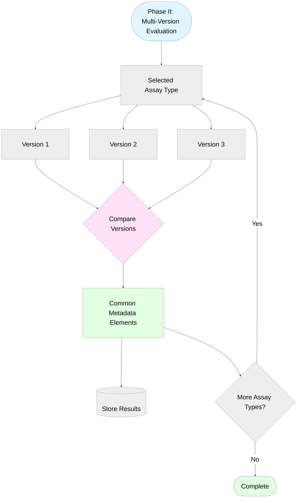

```mermaid
%%{init: {
  'theme': 'neutral',
  'themeVariables': {
    'fontSize': '32px',
    'fontFamily': 'Arial, sans-serif',
    'primaryTextColor': '#000000',
    'primaryBorderColor': '#333333',
    'lineColor': '#333333',
    'secondaryColor': '#f5f5f5',
    'tertiaryColor': '#e8e8e8'
  },
  'flowchart': {
    'nodeSpacing': 100,
    'rankSpacing': 120,
    'curve': 'basis',
    'padding': 50,
    'htmlLabels': true
  }
}}%%
flowchart TD
    Start([Phase II: Multi-Version Evaluation]) --> P2AssayTypes[Selected Assay Type]

    P2AssayTypes --> P2Version1[Version 1]
    P2AssayTypes --> P2Version2[Version 2]
    P2AssayTypes --> P2Version3[Version 3]
    
    P2Version1 --> P2Compare{Compare Versions}
    P2Version2 --> P2Compare
    P2Version3 --> P2Compare
    
    P2Compare --> P2Result[Common Metadata Elements]
    P2Result --> store[(Store Results)]
    P2Result --> EvalAssay{More Assay Types?}

    EvalAssay -->|Yes| P2AssayTypes
    EvalAssay -->|No| End([Complete])
    
    style Start fill:#e1f5ff
    style P2Compare fill:#ffe1f5
    style P2Result fill:#e1ffe1
    style End fill:#e1ffe1
```
