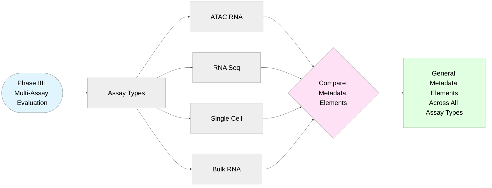

```mermaid
%%{init: {
  'theme': 'neutral',
  'themeVariables': {
    'fontSize': '32px',
    'fontFamily': 'Arial, sans-serif',
    'primaryTextColor': '#000000',
    'primaryBorderColor': '#333333',
    'lineColor': '#333333',
    'secondaryColor': '#f5f5f5',
    'tertiaryColor': '#e8e8e8'
  },
  'flowchart': {
    'nodeSpacing': 100,
    'rankSpacing': 120,
    'curve': 'basis',
    'padding': 50,
    'htmlLabels': true
  }
}}%%
flowchart LR
    Start([Phase III: Multi-Assay Evaluation]) --> P3AssayTypes[Assay Types]
    
    P3AssayTypes --> P3ATACRNA[ATAC RNA]
    P3AssayTypes --> P3RNASeq[RNA Seq]
    P3AssayTypes --> P3SingleCell[Single Cell]
    P3AssayTypes --> P3BulkRNA[Bulk RNA]
    
    P3ATACRNA --> P3Compare{Compare Metadata Elements}
    P3RNASeq --> P3Compare
    P3SingleCell --> P3Compare
    P3BulkRNA --> P3Compare
    
    P3Compare --> P3Result[General Metadata Elements<br/>Across All Assay Types]
    
    style Start fill:#e1f5ff
    style P3Compare fill:#ffe1f5
    style P3Result fill:#e1ffe1
```
