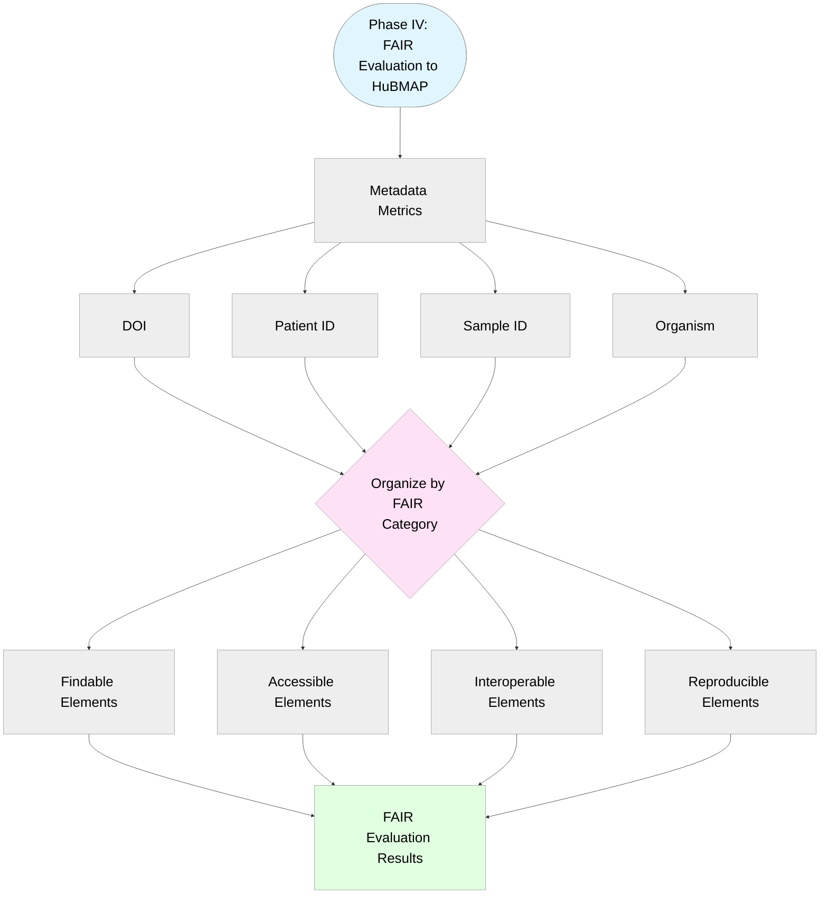

```mermaid
%%{init: {
  'theme': 'neutral',
  'themeVariables': {
    'fontSize': '32px',
    'fontFamily': 'Arial, sans-serif',
    'primaryTextColor': '#000000',
    'primaryBorderColor': '#333333',
    'lineColor': '#333333',
    'secondaryColor': '#f5f5f5',
    'tertiaryColor': '#e8e8e8'
  },
  'flowchart': {
    'nodeSpacing': 100,
    'rankSpacing': 120,
    'curve': 'basis',
    'padding': 50,
    'htmlLabels': true
  }
}}%%
flowchart TD
    Start([Phase IV: FAIR Evaluation to HuBMAP]) --> Metrics[Metadata Metrics]

    Metrics --> P4DOI[DOI]
    Metrics --> P4PatientID[Patient ID]
    Metrics --> P4SampleID[Sample ID]
    Metrics --> P4Organism[Organism]
    
    P4DOI --> P4Category{Organize by FAIR Category}
    P4PatientID --> P4Category
    P4SampleID --> P4Category
    P4Organism --> P4Category

    P4Category --> Findable[Findable Elements]
    P4Category --> Accessible[Accessible Elements]
    P4Category --> Interoperable[Interoperable Elements]
    P4Category --> Reproducible[Reproducible Elements]

    Findable --> Result[FAIR Evaluation Results]
    Accessible --> Result
    Interoperable --> Result
    Reproducible --> Result

    style Start fill:#e1f5ff
    style P4Category fill:#ffe1f5
    style Result fill:#e1ffe1
```
