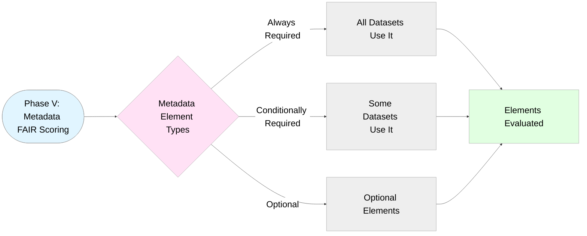

```mermaid
%%{init: {
  'theme': 'neutral',
  'themeVariables': {
    'fontSize': '32px',
    'fontFamily': 'Arial, sans-serif',
    'primaryTextColor': '#000000',
    'primaryBorderColor': '#333333',
    'lineColor': '#333333',
    'secondaryColor': '#f5f5f5',
    'tertiaryColor': '#e8e8e8'
  },
  'flowchart': {
    'nodeSpacing': 100,
    'rankSpacing': 120,
    'curve': 'basis',
    'padding': 50,
    'htmlLabels': true
  }
}}%%
flowchart LR
    Start([Phase V: Metadata FAIR Scoring]) --> P5Types{Metadata Element Types}
    
    P5Types --> |Always Required| AR[All Datasets Use It]
    P5Types --> |Conditionally Required| OR[Some Datasets Use It]
    P5Types --> |Optional| Optional[Optional Elements]

    AR --> P5Result[Elements Evaluated]
    OR --> P5Result
    Optional --> P5Result
        
    style Start fill:#e1f5ff
    style P5Types fill:#ffe1f5
    style P5Result fill:#e1ffe1
```
