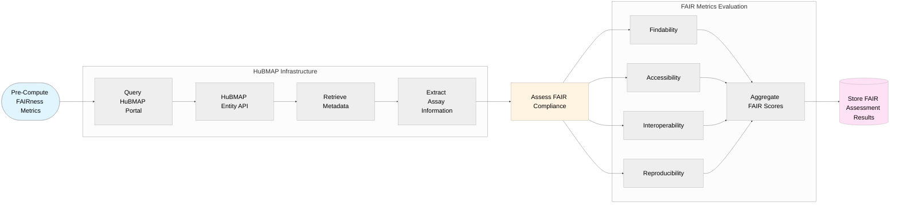

```mermaid
%%{init: {
  'theme': 'neutral',
  'themeVariables': {
    'fontSize': '32px',
    'fontFamily': 'Arial, sans-serif',
    'primaryTextColor': '#000000',
    'primaryBorderColor': '#333333',
    'lineColor': '#333333',
    'secondaryColor': '#f5f5f5',
    'tertiaryColor': '#e8e8e8'
  },
  'flowchart': {
    'nodeSpacing': 100,
    'rankSpacing': 120,
    'curve': 'basis',
    'padding': 50,
    'htmlLabels': true
  }
}}%%
flowchart LR
    Start([Pre-Compute FAIRness Metrics]) --> SearchHuBMAP[Query HuBMAP Portal]
        
    subgraph Infrastructure["HuBMAP Infrastructure"]
        SearchHuBMAP --> HuBMAPPortal[HuBMAP Entity API]
        HuBMAPPortal --> RetrieveMetadata[Retrieve Metadata]
        RetrieveMetadata --> ExtractAssayInfo[Extract Assay Information]
    end

    ExtractAssayInfo --> AssessFAIR[Assess FAIR Compliance]
    
    AssessFAIR --> EvaluateFindable[Findability]
    AssessFAIR --> EvaluateAccessible[Accessibility]
    AssessFAIR --> EvaluateInteroperable[Interoperability]
    AssessFAIR --> EvaluateReproducible[Reproducibility]
        
    subgraph FAIRMetrics["FAIR Metrics Evaluation"]
        EvaluateFindable --> AggregateScores[Aggregate FAIR Scores]
        EvaluateAccessible --> AggregateScores
        EvaluateInteroperable --> AggregateScores
        EvaluateReproducible --> AggregateScores
    end

    AggregateScores --> StoreResults[(Store FAIR Assessment Results)]

    style Start fill:#e1f5ff
    style AssessFAIR fill:#fff4e1
    style StoreResults fill:#ffe1f5
```
