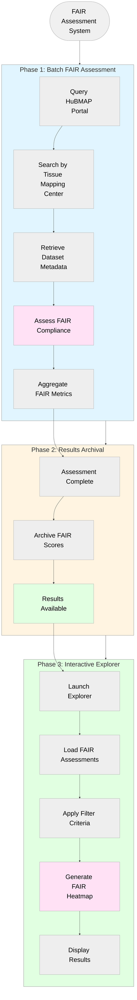

```mermaid
%%{init: {
  'theme': 'neutral',
  'themeVariables': {
    'fontSize': '32px',
    'fontFamily': 'Arial, sans-serif',
    'primaryTextColor': '#000000',
    'primaryBorderColor': '#333333',
    'lineColor': '#333333',
    'secondaryColor': '#f5f5f5',
    'tertiaryColor': '#e8e8e8'
  },
  'flowchart': {
    'nodeSpacing': 100,
    'rankSpacing': 120,
    'curve': 'basis',
    'padding': 50,
    'htmlLabels': true
  }
}}%%
flowchart TD
    Start([FAIR Assessment System]) --> Phase1[Phase 1: Batch FAIR Assessment]
    Phase1 --> Phase2[Phase 2: Results Archival]
    Phase2 --> Phase3[Phase 3: Interactive Explorer]
    
    subgraph Phase1["Phase 1: Batch FAIR Assessment"]
        direction TB
        P1Start[Query HuBMAP Portal] --> P1Search[Search by Tissue Mapping Center]
        P1Search --> P1Retrieve[Retrieve Dataset Metadata]
        P1Retrieve --> P1Assess[Assess FAIR Compliance]
        P1Assess --> P1Aggregate[Aggregate FAIR Metrics]
    end
    
    subgraph Phase2["Phase 2: Results Archival"]
        direction TB
        P2Start[Assessment Complete] --> P2Archive[Archive FAIR Scores]
        P2Archive --> P2Ready[Results Available]
    end
    
    subgraph Phase3["Phase 3: Interactive Explorer"]
        direction TB
        P3Start[Launch Explorer] --> P3Load[Load FAIR Assessments]
        P3Load --> P3Filter[Apply Filter Criteria]
        P3Filter --> P3Visualize[Generate FAIR Heatmap]
        P3Visualize --> P3Display[Display Results]
    end
    
    P1Aggregate --> P2Start
    P2Ready --> P3Start
    
    style Phase1 fill:#e1f5ff
    style Phase2 fill:#fff4e1
    style Phase3 fill:#e1ffe1
    style P1Assess fill:#ffe1f5
    style P2Ready fill:#e1ffe1
    style P3Visualize fill:#ffe1f5
    style Start fill:#f0f0f0
```
