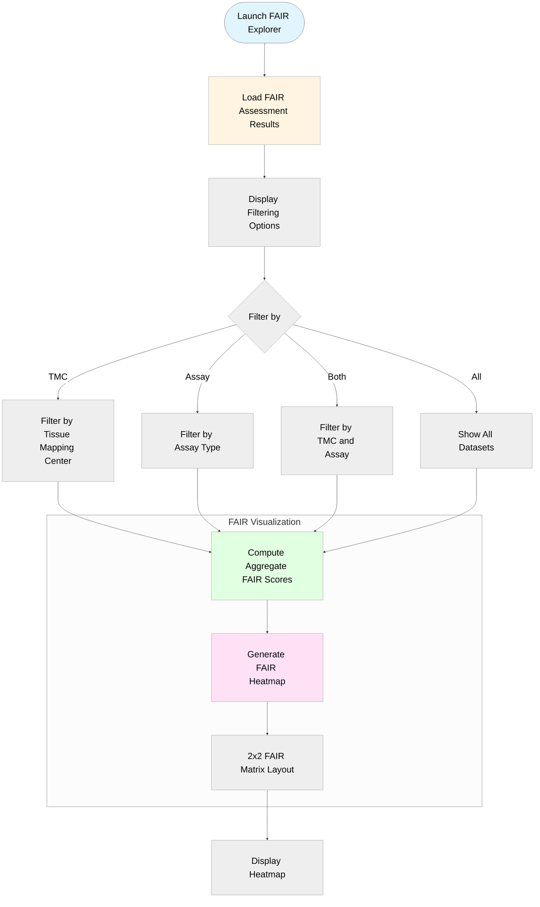

```mermaid
%%{init: {
  'theme': 'neutral',
  'themeVariables': {
    'fontSize': '32px',
    'fontFamily': 'Arial, sans-serif',
    'primaryTextColor': '#000000',
    'primaryBorderColor': '#333333',
    'lineColor': '#333333',
    'secondaryColor': '#f5f5f5',
    'tertiaryColor': '#e8e8e8'
  },
  'flowchart': {
    'nodeSpacing': 100,
    'rankSpacing': 120,
    'curve': 'basis',
    'padding': 50,
    'htmlLabels': true
  }
}}%%
flowchart TD
    Start([Launch FAIR Explorer]) --> LoadAssessments[Load FAIR Assessment Results]
    LoadAssessments --> UserSelection[Display Filtering Options]
    UserSelection --> FilterCriteria{Filter by}
    
    FilterCriteria -->|TMC| FilterTMC[Filter by Tissue Mapping Center]
    FilterCriteria -->|Assay| FilterAssay[Filter by Assay Type]
    FilterCriteria -->|Both| FilterCombined[Filter by TMC and Assay]
    FilterCriteria -->|All| ShowAllDatasets[Show All Datasets]

    FilterTMC --> ComputeAggregate[Compute Aggregate FAIR Scores]
    FilterAssay --> ComputeAggregate
    FilterCombined --> ComputeAggregate
    ShowAllDatasets --> ComputeAggregate
    
    subgraph Visualization["FAIR Visualization"]
        ComputeAggregate --> GenerateHeatmap[Generate FAIR Heatmap]
        GenerateHeatmap --> HeatmapDisplay[2x2 FAIR Matrix Layout]
    end
    
    HeatmapDisplay --> Display[Display Heatmap]
    
    style Start fill:#e1f5ff
    style LoadAssessments fill:#fff4e1
    style ComputeAggregate fill:#e1ffe1
    style GenerateHeatmap fill:#ffe1f5
```
