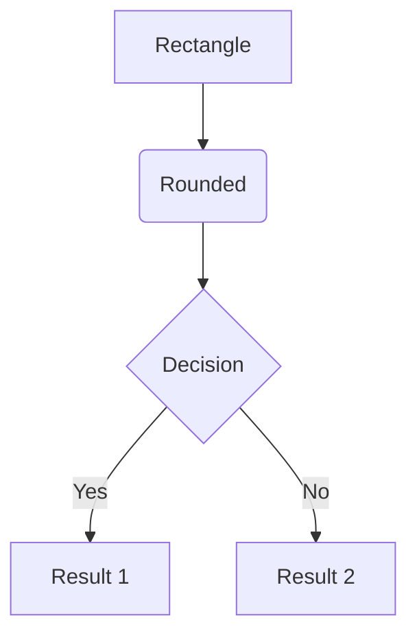
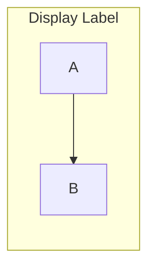
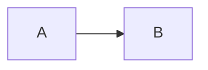

# Mermaid.js Syntax Reference

Source: https://mermaid.ai/open-source/intro/getting-started.html

## Installation

```bash
npm install -g @mermaid-js/mermaid-cli
```

## CLI Rendering (mmdc)

```bash
# Basic render
mmdc -i input.mmd -o output.png

# High-resolution render (for papers)
mmdc -i input.mmd -o output.png -s 4 -w 2400 -b white

# SVG output
mmdc -i input.mmd -o output.svg

# With custom config
mmdc -i input.mmd -o output.png -c config.json
```

## Flowchart Syntax



### Node Shapes

| Syntax | Shape |
|--------|-------|
| `A[text]` | Rectangle |
| `A(text)` | Rounded rectangle |
| `A([text])` | Stadium/pill |
| `A[[text]]` | Subroutine |
| `A[(text)]` | Cylindrical (database) |
| `A((text))` | Circle |
| `A{text}` | Diamond/rhombus |
| `A{{text}}` | Hexagon |
| `A>text]` | Asymmetric |
| `A[/text/]` | Parallelogram |
| `A[\text\]` | Alt parallelogram |
| `A[/text\]` | Trapezoid |
| `A[\text/]` | Alt trapezoid |

### Direction

- `TD` / `TB` -- Top to bottom
- `BT` -- Bottom to top
- `LR` -- Left to right
- `RL` -- Right to left

### Links

| Syntax | Description |
|--------|-------------|
| `A --> B` | Arrow |
| `A --- B` | Line |
| `A -.- B` | Dotted line |
| `A -.-> B` | Dotted arrow |
| `A ==> B` | Thick arrow |
| `A -- text --> B` | Arrow with text |
| `A -->&#124;text&#124; B` | Arrow with text (alt) |

### Subgraphs



### Styling

```mermaid
%%{init: {
  'theme': 'neutral',
  'themeVariables': {
    'fontSize': '32px',
    'fontFamily': 'Arial, sans-serif'
  },
  'flowchart': {
    'nodeSpacing': 100,
    'rankSpacing': 120,
    'curve': 'basis'
  }
}}%%
```

## Embedding in HTML

```html
<script type="module">
  import mermaid from 'https://cdn.jsdelivr.net/npm/mermaid@11/dist/mermaid.esm.min.mjs';
  mermaid.initialize({ startOnLoad: true });
</script>

<pre class="mermaid">
  flowchart LR
    A --> B
</pre>
```

## Embedding in Markdown

````markdown

````

## Tips for High-Resolution Paper Figures

1. Use `-s 4` (scale 4x) with `mmdc` for print-quality output
2. Use `-b white` for white background (required for print)
3. Use `'fontSize': '32px'` in init config for poster/paper readability
4. Prefer `TD` (top-down) for vertical flows, `LR` for horizontal pipelines
5. Keep node text concise for clarity at small print sizes
